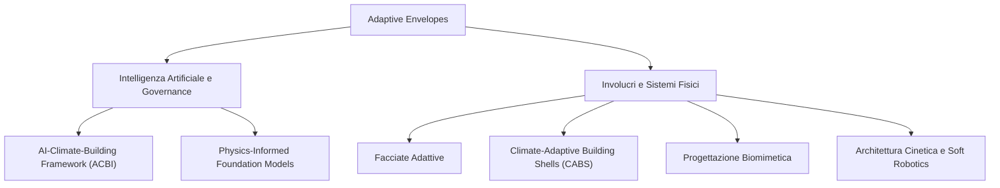

---
tags:
  - moc
---

# 🗺️ MOC - Adaptive Envelopes

Questa mappa raccoglie e indicizza i concetti estratti dalle ricerche sull'involucro edilizio e agricolo adattivo e predittivo, guidato dall'intelligenza artificiale e dal machine learning.

## Intelligenza Artificiale e Governance
- [[Concept - AI-Climate-Building Integration Framework (ACBI)]]
- [[Concept - Physics-Informed Foundation Models per l'Architettura]]

## Predizione Microclimatica e Machine Learning

## Sistemi Fisici: Architettura
- [[Concept - Facciate Adattive]]
- [[Concept - Climate-Adaptive Building Shells (CABS)]]
- [[Concept - Progettazione Biomimetica per Facciate]]
- [[Concept - Architettura Cinetica e Soft Robotics]]
- [[Concept - Compositi Edilizi Responsivi]]
- [[Concept - Materiali a Gradazione Funzionale (FGM)]]
- [[Concept - Retrofitting e Involucri Adattivi]]
- [[Concept - Building Performance Simulation (BPS)]]
- [[Concept - Fabrication-Aware Design]]
- [[Concept - Digital Twin in Architettura]]
- [[Concept - Metodologia Frame Insight]]
- [[Concept - Strutture Ombreggianti Pieghevoli]]
- [[Concept - Ostacoli Commerciali alle Facciate Adattive]]
- [[Concept - Life Cycle Assessment (LCA) in Involucri]]
- [[Concept - CNC-Knitted Textiles in Architettura]]
- [[Concept - Strutture a Flessione Attiva (Bending-Active)]]
- [[Concept - Evoluzione Algoritmica Facciate]]
- [[Concept - Model Predictive Control (MPC)]]
- [[Concept - Strutture Cinetiche per Spazi Urbani]]
- [[Concept - Urban Open Spaces Comfort]]
- [[Concept - Facciate Biodegradabili e Circolari]]
- [[Concept - BIPV Flessibile e Stand-alone]]
- [[Concept - Payback e ROI nell'Involucro Dinamico]]
