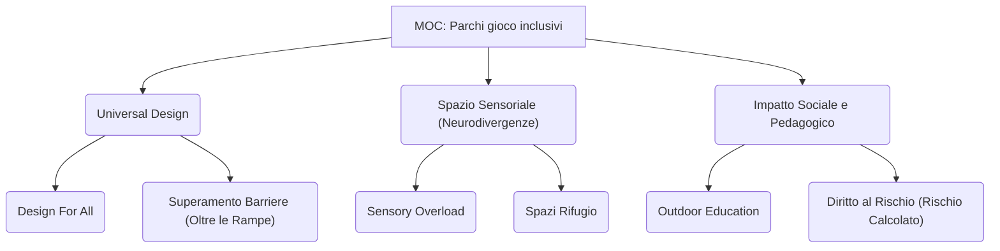

---
tags:
  - moc
  - parchi_gioco
  - universal_design
  - inclusione
---

# 🗺️ MOC - Parchi gioco inclusivi

Questa Map of Content raccoglie i concetti e le fonti riguardanti la progettazione, l'impatto pedagogico e le dinamiche sociali dei parchi gioco e degli spazi aperti inclusivi, con particolare attenzione all'approccio Universal Design e alla neurodivergenza.

## 💡 Concetti Chiave

| Concetto | Ultima Modifica |
| :--- | :--- |
| [[Concept - Accessibilita come Prerequisito Inclusione come Attivita]] | 2026-06-09 |
| [[Concept - Accessibilità Cognitiva e Sensoriale]] | 2026-06-09 |
| [[Concept - Accessibilità vs Usabilità]] | 2026-06-09 |
| [[Concept - Atteggiamento Ludico (Playfulness)]] | 2026-06-09 |
| [[Concept - CAM e Sostenibilita Sociale]] | 2026-06-09 |
| [[Concept - Co-progettazione inclusiva]] | 2026-06-09 |
| [[Concept - Condiscendenza Ludica]] | 2026-06-09 |
| [[Concept - Critical Play]] | 2026-06-09 |
| [[Concept - Dicotomia Game e Play]] | 2026-06-09 |
| [[Concept - Funzione educante e socializzante del Gioco]] | 2026-06-09 |
| [[Concept - Il Paradosso della Panchina Inclusiva]] | 2026-06-09 |
| [[Concept - Laboratorio Sensoriale Esterno]] | 2026-06-09 |
| [[Concept - Libro Multicodice]] | 2026-06-09 |
| [[Concept - Limiti del Gioco a Catalogo]] | 2026-06-09 |
| [[Concept - Ludodiversità e Giochi Tradizionali]] | 2026-06-09 |
| [[Concept - Materiale ludico non strutturato]] | 2026-06-09 |
| [[Concept - Modello COST LUDI]] | 2026-06-09 |
| [[Concept - Modello Person-Environment-Occupation (PEO)]] | 2026-06-09 |
| [[Concept - Outdoor Education come Strumento di Inclusione]] | 2026-06-09 |
| [[Concept - Play Assessment]] | 2026-06-09 |
| [[Concept - Play-based Assessment]] | 2026-06-09 |
| [[Concept - Principi Universal Design]] | 2026-06-09 |
| [[Concept - Progettazione Partecipata degli Spazi Educativi]] | 2026-06-09 |
| [[Concept - Sicurezza tramite Vitalita (Eyes on the street)]] | 2026-06-09 |
| [[Concept - Spazi Rifugio per la Neurodivergenza]] | 2026-06-09 |
| [[Concept - Universal Design for Learning nel Gioco]] | 2026-06-09 |
| [[Concept - User-Centered Design per l'Inclusione]] | 2026-06-09 |
| [[Concept - Valutazione Multidimensionale del Giocattolo Inclusivo]] | 2026-06-09 |
| [[Concept - Vegetazione Abitabile (Nature Play)]] | 2026-06-09 |
| [[Concept - Wayfinding Inclusivo nei Parchi]] | 2026-06-09 |
| [[Concept - Zona di Sviluppo Prossimale nel Gioco]] | 2026-06-09 |

## 🏟️ Casi di Studio e Progetti

| Progetto | Luogo | Target |
| :--- | :--- | :--- |
| [[Casestudy - Focus Group Università di Catania]] | Università degli Studi di Catania, Italia | Studenti universitari (futuri educatori 0-6) |
| [[Casestudy - Football for Social Inclusion]] | Europa / Contesti globali | Giovani migranti, rifugiati, comunità locali |
| [[Casestudy - Multiparc Parco di Sant Eusebio (Genova)]] | Genova (Quartiere Sant'Eusebio) | Bambini, famiglie, utenti con disabilità sensoriali e cognitive (neurodivergenze) |
| [[Casestudy - Parco Albero del Tesoro]] | Padova, Italia | Bambini con e senza disabilità, cittadinanza |
| [[Casestudy - Parco Belvedere Alpino]] | Briaglia (CU), Italia | Bambini con e senza disabilità, residenti |
| [[Casestudy - Parco Libera Tutti (Certaldo)]] | Certaldo (Firenze) | Intera cittadinanza (bambini, disabili, anziani, associazioni locali) |
| [[Casestudy - Progettazione Partecipata in Emilia Romagna]] | Provincia di Reggio Emilia, Italia | Bambini di nidi e scuole dell'infanzia (0-6 anni) |
| [[Casestudy - Progetto Giochiamo tutti]] | Genova (Porto Antico), Milano (Parco Formentano), L'Aquila (Parco di Viale Rendina), Italia | Bambini con disabilità motorie, sensoriali e intellettivo/relazionali, e loro accompagnatori. |
| [[Casestudy - Progetto Gioco al Centro Milano]] | Milano, Italia | Bambini, scuole dell'infanzia, primarie e associazioni disabilità |
| [[Casestudy - Progetto Lernumgebungen]] | Libera Università di Bolzano, Facoltà di Scienze della Formazione, Bressanone | Bambini della scuola primaria |
| [[Casestudy - Ricerca Universita Clementoni]] | Italia | Bambini con disabilità sensoriali, motorie, cognitive e relazionali |
| [[Casestudy - Scuola Primaria via Polesine]] | Milano (periferia sud-est) | Alunni della scuola primaria, Insegnanti, Famiglie, Comunità locale |

## 📄 Fonti Bibliografiche e Articoli

| Fonte | Autore | Anno |
| :--- | :--- | :--- |
| [[Paper - Configurazione multisensoriale della stanza all'aperto (Segalerba)]] | Arianna Segalerba | 2024 |
| [[Paper - Creare l'inclusivita TO e parchi giochi]] | Francesca Buosi | 2016 |
| [[Paper - Il Gioco come ponte sociale]] | Valentina Pastorelli | 2025 |
| [[Paper - Il gioco in chiave inclusiva]] | Valentina Perciavalle | 2022 |
| [[Paper - Inclusione 3.0 - Il diritto al gioco]] | Catia Giaconi, Noemi Del Bianco (Curatrici), Paola Nicolini et al. | 2018 |
| [[Paper - Panchine per tutti tra inclusione e design ostile (Tatano)]] | Valeria Tatano | 2023 |
| [[Paper - Parchi giochi e CAM (Mezzalana et al.)]] | Fabrizio Mezzalana, Teresa Villani, Giulia Pentella | 2025 |
| [[Paper - Pedagogia del gioco il gioco inclusivo]] | Francesca Berti | 2022 |
| [[Paper - Progettare spazi inclusivi all'aperto (Schenetti)]] | Michela Schenetti (a cura di) | 2025 |
| [[Paper - Progetto Giochi sensoriali in condivisione]] | Martina Mantegazza | 2020 |
| [[Paper - Spazi Aperti per Tutti - Gioco al Centro 1]] | Anna Moro, Gianfranco Orsenigo | 2024 |
| [[Paper - Spazi Aperti per Tutti - Gioco al Centro 2]] | Anna Moro, Gianfranco Orsenigo | 2024 |
| [[Paper - Spazi e pagine che includono un Parco un libro]] | Enrica Polato, Maria Eleonora Reffo | 2023 |
| [[Paper - Spazi verdi accessibili e inclusivi (Fiaschi)]] | Michela Fiaschi, Caterina Fusi, Diego Cariani (Narrazioni Urbane) | N.D. (Post 2019) |
| [[Paper - Valutare l'evoluzione del gioco (Besio, Bianquin)]] | Serenella Besio, Nicole Bianquin | 2025 |

## 🔍 Insights Trasversali
- [[Insight - Parchi gioco inclusivi]]
