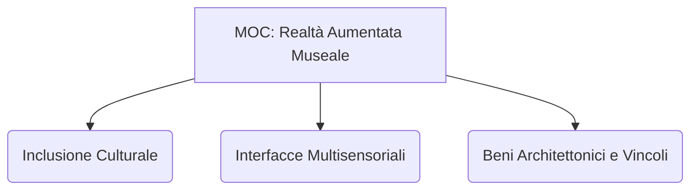

---
tags:
  - moc
  - index
taccuino: "[[Notebook - Realtà Aumentata Patrimonio]]"
---

# 🗺️ MOC - Realtà Aumentata Museale

## 🌟 Visione d'Insieme
Questa mappa aggrega la ricerca sull'applicazione della **Realtà Aumentata (AR)** e delle tecnologie immersive nel contesto dei Beni Culturali, con un focus particolare sull'**inclusività** e l'accessibilità museale per persone con disabilità.

## 📚 Fonti di Ricerca (Sources)
*Analisi sistematica dei paper e documenti processati.*

| Fonte | Anno | Tipologia |
| :--- | :--- | :--- |
| [[Paper - Inclusive AR-VR Accessibility Barriers]] | - | - |
| [[Paper - Digitisation of Heritage Sites via Augmented Reality]] | - | - |
| [[Paper - An Innovative Approach to Cultural Accessibility]] | - | - |
| [[Paper - Accessibility of Cultural Heritage Sites for People with Disabilities]] | - | - |
| [[Paper - A.R.I.A. Augmented Reality per l'Inclusività Aumentata]] | - | - |

## 💡 Framework Concettuale (Concepts)
*Note atomiche che definiscono i pilastri teorici.*

| Concetto | Ultimo Aggiornamento |
| :--- | :--- |
| [[Accessibility Barriers in XR]] | 2026-05-23 |
| [[Accessible Tourism]] | 2026-05-23 |
| [[Artefatti Cognitivi]] | 2026-05-23 |
| [[Audit di Accessibilità Digitale]] | 2026-05-23 |
| [[CHx Toolkit]] | 2026-05-23 |
| [[Digital Divide]] | 2026-05-23 |
| [[Diversamente abili]] | 2026-05-23 |
| [[Edutainment]] | 2026-05-23 |
| [[Experience-centered design]] | 2026-05-23 |
| [[Fruizione Interattiva]] | 2026-05-23 |
| [[Gamification Museale]] | 2026-05-23 |
| [[Inclusione Sociale]] | 2026-05-23 |
| [[Intelligenza Artificiale (AI)]] | 2026-05-23 |
| [[Lived Experience]] | 2026-05-23 |
| [[Multisensorialità]] | 2026-05-23 |
| [[Policy-implementation gap]] | 2026-05-23 |
| [[Realtà Aumentata (AR) nei Beni Culturali]] | 2026-05-23 |
| [[Sandpit Research]] | 2026-05-23 |
| [[Universal Design]] | 2026-05-23 |
| [[WCAG 2.1]] | 2026-05-23 |

## 🏗️ Casi di Studio (Case Studies)
*Analisi di implementazioni reali e sperimentazioni tecnologiche.*

| Progetto | Localizzazione | Ambito |
| :--- | :--- | :--- |
| [[Casestudy - A.R.I.A. (Augmented Reality per l’Inclusività Aumentata)]] | Italia (Sede di Varese, Associazione Sacra Famiglia) | Riabilitativo / Educativo / Inclusione Neurodivergenti |
| [[Casestudy - AIGuide]] | Ricerca accademica internazionale | Riabilitazione Visiva / Accessibilità Quotidiana |
| [[Casestudy - AR4VI]] | Ricerca accademica internazionale | Accessibilità / Ausili Tecnologici Avanzati |
| [[Casestudy - ARCH•I Torino  Area Archeologica Centrale di Roma]] | Italia (Torino e Fori Imperiali di Roma) | Beni Culturali / Archeologia / Intelligenza Artificiale |
| [[Casestudy - ARtGlass]] | Museo Civico di San Gimignano (Siena, Italia); siti globali | Museale / Siti Archeologici / Patrimonio Culturale |
| [[Casestudy - AUGI (Augmented Urban Grey Interface)]] | Contesti urbani storici (Ricerca internazionale) | Patrimonio Urbano Invisibile / Edutainment |
| [[Casestudy - Applicazione AR City Art Gallery]] | City Art Gallery | Beni Culturali / Storytelling |
| [[Casestudy - Augmented Don Quixote (App Dulcinea)]] | Italia (Biblioteca Storica Arturo Graf, Università di Torino) | Teatro / Letteratura / Beni Culturali |
| [[Casestudy - Augmented Turin Baroque Atria]] | Italia (Atri storici torinesi: Palazzo Carignano, Novarina, Cigliano, Coardi di Carpenetto) | Beni Culturali / Ricerca Universitaria |
| [[Casestudy - C[AR]ds™ Prototype]] | Egitto / Ricerca internazionale (Bayt al-Suhaymi, Il Cairo) | Educazione Patrimonio (CHx) / Accessibilità Museale |
| [[Casestudy - Castello Reale del Wawel - Accessibilità Digitale]] | Cracovia, Polonia | Patrimonio Storico Monumentale / Accessibilità Integrata |
| [[Casestudy - Disuffo]] | Italia (Licei e Istituti Tecnici) | Educativo / Edutainment |
| [[Casestudy - Dynamic Light and Augmented Reality]] | Venezia, Italia (Scuola Grande di San Rocco) | Museale / Valorizzazione Pittorica |
| [[Casestudy - ExPLoRAA]] | Roma — Municipio III (percorso Madonnelle) | Patrimonio Culturale Urbano / Salute / Invecchiamento Attivo |
| [[Casestudy - F.A.R.E. e FOCUS VR]] | Associazione Sacra Famiglia (Italia) | Riabilitativo / Terapeutico / Inclusione Neurodivergenti |
| [[Casestudy - GUINEVERE]] | Europa (progetto EU multi-partner) | Educativo / Scolastico |
| [[Casestudy - Google Glass_4_Lis (progetto ATLAS)]] | Museo Egizio di Torino — Statua di Ramses II | Museale / Inclusione / Accessibilità |
| [[Casestudy - ID4Ex (Immersive design and new digital competences for the rehabilitation and valorization of the built heritage)]] | Cooperazione europea (es. Warsaw University of Technology, Polonia e Università degli Studi di Ferrara, Italia). Sito pilota: Santana House a Madeira, Portogallo. | Beni Culturali / Museale |
| [[Casestudy - Iconografie Aumentate (Theatrum Sabaudiae)]] | Torino, Italia — Politecnico di Torino / Database Cult | Patrimonio Storico-Cartografico / Ricerca Accademica |
| [[Casestudy - Inside the Last Supper]] | Refettorio di Santa Maria delle Grazie, Milano (IT) | Arte / Patrimonio UNESCO / Esperienze Immersive |
| [[Casestudy - MNEMOSYNE]] | Museo Nazionale del Bargello, Firenze (IT) — Sala di Donatello | Museale / Smart Museum / Analisi Comportamentale |
| [[Casestudy - MOCAK (Museum of Contemporary Art in Krakow)]] | Cracovia, Polonia | Museale Contemporaneo / Inclusione Architettonica |
| [[Casestudy - Magic Tools]] | Politecnico di Milano (IT) | Riabilitativo / Terapeutico / Disturbi del Neurosviluppo |
| [[Casestudy - MediaEvo]] | Otranto, Italia (Università del Salento) | Beni Culturali / Patrimonio Medievale |
| [[Casestudy - MoveCare]] | Università di Milano (IT) + partner EU (Horizon 2020) | Assistenza domiciliare / Invecchiamento Attivo |
| [[Casestudy - NAVIG]] | Francia (ricerca accademica); applicazione in contesti urbani e indoor | Navigazione Assistiva / Accessibilità Urbana e Patrimonio |
| [[Casestudy - Orpheo]] | Fori Imperiali, Roma (IT); siti culturali globali | Archeologico / Museale / Accessibilità Acustica |
| [[Casestudy - PoeticAR]] | Giardino Jichang, Wuxi, Cina | Patrimonio Culturale Intangibile / Paesaggistico / Letterario |
| [[Casestudy - Pompei per Tutti e progetto Con-me (Smart Pompei)]] | Sito Archeologico di Pompei, Italia (patrimonio UNESCO) | Archeologico / Accessibilità Fisica e Sensoriale / Turismo Inclusivo |
| [[Casestudy - Ram Bagh Smart Gardens]] | Amritsar, India (sito storico monumentale) | Gestione Patrimonio / Turismo Accessibile |
| [[Casestudy - Robot@school (Le Chiavi della Città)]] | Firenze, Italia (59 classi coinvolte) | Educativo / Scolastico / Patrimonio Culturale |
| [[Casestudy - The Living Paintings]] | Gallerie d'arte (localizzazione specifica non definita nel paper) | Museale / Arte / Mediazione Culturale |
| [[Casestudy - Valorizzazione dell'Anfiteatro romano di Catania]] | Catania, Italia | Archeologico Urbano / Heritage Digitale |
| [[Casestudy - WebAR Museo Archeologico Nazionale]] | Museo Archeologico Nazionale | Beni Culturali / Museale |
| [[Casestudy - XOOMWildcard]] | Politecnico di Milano (IT) | Educativo / Riabilitativo / Inclusione Neurodivergenti |
| [[Casestudy - e-REAL (Enhanced Reality Lab)]] | Politecnico di Milano (IT); Harvard Medical Simulation, Boston (USA) | Formazione / Simulazione Medica / Apprendimento Professionale |
| [[Casestudy - eCraft2Learn]] | Technopolis City, Atene (GR); partner EU multi-paese | Educativo / Informale (Musei, FabLab, Scuole) |

## 🎯 Categorizzazione & Target
- **Inclusività Sensoriale:** [[Casestudy - AR4VI]], [[Casestudy - NAVIG]], [[Casestudy - Google Glass_4_Lis (progetto ATLAS)]]
- **Patrimonio Archeologico:** [[Casestudy - Valorizzazione dell'Anfiteatro romano di Catania]], [[Casestudy - Pompei per Tutti e progetto Con-me (Smart Pompei)]]
- **Gamification/Edutainment:** [[Casestudy - Castello Reale del Wawel - Accessibilità Digitale]], [[Casestudy - C[AR]ds™ Prototype]]

---
**Ultimo aggiornamento:** 2026-05-12
**Stato della Ricerca:** In corso.
