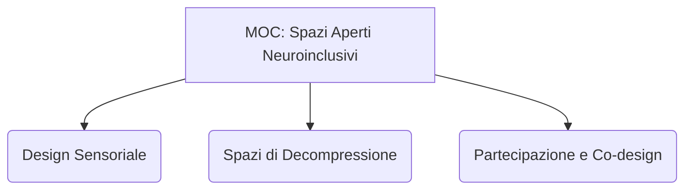

---
tags:
  - moc
  - index
taccuino: "[[Notebook - Spazi Aperti Neuroinclusivi]]"
---

# 🗺️ MOC - Spazi Aperti Neuroinclusivi

## 🌟 Visione d'Insieme
Questa Mappa del Contenuto (MOC) organizza e struttura la ricerca interdisciplinare relativa alla progettazione di **Spazi Aperti Neuroinclusivi**. L'obiettivo è analizzare e sistematizzare le relazioni tra lo spazio fisico (parchi, giardini, piazze e contesti urbani) e il benessere cognitivo, sensoriale e sociale delle persone neurodivergenti (nello spettro autistico, ADHD, DSA, e con fragilità cognitive o demenze).

---

## 📚 Fonti di Ricerca (Sources)
*Analisi sistematica dei paper e saggi scientifici processati.*

| Fonte | Anno | Tipologia |
| :--- | :--- | :--- |
| [[Paper - Attaianese (2025) - Neuroscientific Approaches]] | - | - |
| [[Paper - Finnigan (2024) - Sensory Responsive Environments]] | - | - |
| [[Paper - Gambardella (2024) - Neuro-Inclusive Design]] | - | - |
| [[Paper - Trieste (2025) - Architecture and Autism]] | - | - |
| [[Paper - Rachev (2025) - DIY Play and Neuro-Non-Typical Urbanism]] | - | - |

---

## 💡 Framework Concettuale (Concepts)
*Note atomiche che definiscono i pilastri teorici della neuroinclusione e del design sensoriale.*

| Concetto | Ultimo Aggiornamento |
| :--- | :--- |
| [[Concept - Accessibilità Relazionale e Sociale]] | 2026-05-23 |
| [[Concept - Affordance Sensoriale]] | 2026-05-23 |
| [[Concept - Ambienti Reattivi (Smart Environments)]] | 2026-05-23 |
| [[Concept - Atipicità Sensoriale]] | 2026-05-23 |
| [[Concept - Co-creation]] | 2026-05-23 |
| [[Concept - Design for Adaptability]] | 2026-05-23 |
| [[Concept - Diritto alla Città]] | 2026-05-23 |
| [[Concept - Giustizia Spaziale]] | 2026-05-23 |
| [[Concept - Healing Gardens]] | 2026-05-23 |
| [[Concept - Inclusion Infrastructure]] | 2026-05-23 |
| [[Concept - Indessicalità e Riflessività]] | 2026-05-23 |
| [[Concept - Intersoggettività Corporea]] | 2026-05-23 |
| [[Concept - Invecchiamento Attivo]] | 2026-05-23 |
| [[Concept - Material Authenticity]] | 2026-05-23 |
| [[Concept - Neuro-Non-Typical Urbanism]] | 2026-05-23 |
| [[Concept - Neurodiversità]] | 2026-05-23 |
| [[Concept - Responsive Environments]] | 2026-05-23 |
| [[Concept - SREF Framework]] | 2026-05-23 |
| [[Concept - Self-advocates]] | 2026-05-23 |
| [[Concept - Sensory Escapes]] | 2026-05-23 |
| [[Concept - Soft Fascination]] | 2026-05-23 |
| [[Concept - Solar-based navigation]] | 2026-05-23 |
| [[Concept - The Neurodiverse City]] | 2026-05-23 |
| [[Concept - The Restorative City]] | 2026-05-23 |
| [[Concept - Trigger Sensoriali]] | 2026-05-23 |
| [[Concept - Urbanistica Collaborativa]] | 2026-05-23 |

---

## 🏗️ Casi di Studio (Case Studies)
*Analisi di progetti reali, infrastrutture urbane, installazioni e sperimentazioni sul campo.*

| Progetto | Localizzazione | Ambito |
| :--- | :--- | :--- |
| [[Casestudy - ASD Publics Barcelona]] | Barcellona, Spagna | Urbanistica e pianificazione di parchi urbani inclusivi |
| [[Casestudy - Analisi Comunicativa dell'Interazione di Chil]] | Stati Uniti | Ambito Etnometodologico, Ricerca Comunicativa |
| [[Casestudy - BeSENSHome]] | Italia (Trieste, Bolzano) – Austria (Carinzia) | Residenziale, Day Center, Scolastico, Lavorativo |
| [[Casestudy - Condominio Intergenerazionale a Campagnuzza]] | Gorizia (Friuli-Venezia Giulia), Italia | Ambito Residenziale, Co-housing Intergenerazionale |
| [[Casestudy - DIY Play and Neuro-Non-Typical Urbanism (Auckland)]] | Auckland (Tāmaki Makaurau), Nuova Zelanda | Parchi Pubblici, Spazi Verdi di Quartiere, Installazioni Temporanee |
| [[Casestudy - Giardino Sensoriale Kingwood College]] | Reading, Regno Unito | Ambito Educativo, Spazio Sensoriale |
| [[Casestudy - Giardino Terapeutico (Centro Diurno La Baracca)]] | Salerano Canavese (Piemonte), Italia | Struttura Sanitaria, Centro Diurno |
| [[Casestudy - Giardino Terapeutico Hampshire]] | Hampshire, Regno Unito | Struttura Residenziale, Assistenza Sociale |
| [[Casestudy - Giardino Terapeutico Sedgewood Commons]] | Falmouth (Maine), USA | Struttura Residenziale, Alzheimer Care |
| [[Casestudy - Giardino Terapeutico e Sensoriale RSA Ad Maiores]] | Trieste (Friuli-Venezia Giulia), Italia | Struttura Sanitaria, Spazio Terapeutico Urbano |
| [[Casestudy - Giardino della Felicità (CIDAS CRA Residence Service)]] | Ferrara, Italia | Struttura Sanitaria, Spazio Terapeutico |
| [[Casestudy - Integrazione Strumenti PEBA e UDL]] | Italia / Unione Europea | Ambito Istituzionale, Progettazione Urbana e Pedagogica |
| [[Casestudy - MPK Krakow]] | Cracovia, Polonia | Trasporto pubblico e nodi di mobilità urbana |
| [[Casestudy - Play AUT the Box]] | Barcellona, Spagna | Progettazione di parchi gioco e aree ricreative all'aperto |
| [[Casestudy - Tauron Arena Krakow]] | Cracovia, Polonia | Infrastrutture per la cultura, lo sport e il tempo libero |
| [[Casestudy - The Neurodiverse City]] | New York City (New York), USA | Urbano, Spazio Pubblico, Piazze e Strade Pedonali |
| [[Casestudy - Towards Neuroinclusive Public Open Spaces (Sydney)]] | Sydney, Australia | Urbano, Marciapiedi, Strade, Parchi e Piazze Metropolitane |

---

## 🎯 Categorizzazione & Target
*Organizzazione mirata dei casi di studio per coorti e ambiti applicativi.*

- **Pediatria/Infanzia:**
  - [[Casestudy - ASD Publics Barcelona]]
  - [[Casestudy - Play AUT the Box]]
  - [[Casestudy - DIY Play and Neuro-Non-Typical Urbanism (Auckland)]]
- **Adulti e Studenti Neurodivergenti:**
  - [[Casestudy - Giardino Sensoriale Kingwood College]]
  - [[Casestudy - BeSENSHome]]
- **Urbano, Infrastrutture e Spazi Pubblici:**
  - [[Casestudy - The Neurodiverse City]]
  - [[Casestudy - MPK Krakow]]
  - [[Casestudy - Tauron Arena Krakow]]
  - [[Casestudy - Integrazione Strumenti PEBA e UDL]]
  - [[Casestudy - Towards Neuroinclusive Public Open Spaces (Sydney)]]
- **Demenza, Alzheimer e RSA (Healing Gardens):**
  - [[Casestudy - Giardino della Felicità (CIDAS CRA Residence Service)]]
  - [[Casestudy - Giardino Terapeutico (Centro Diurno La Baracca)]]
  - [[Casestudy - Giardino Terapeutico Sedgewood Commons]]
  - [[Casestudy - Giardino Terapeutico Hampshire]]
  - [[Casestudy - Giardino Terapeutico e Sensoriale RSA Ad Maiores]]
- **Inclusione Sociale ed Etnometodologia:**
  - [[Casestudy - Condominio Intergenerazionale a Campagnuzza]]
  - [[Casestudy - Analisi Comunicativa dell'Interazione di Chil]]

---

## 📑 Sintesi Avanzate & Insights
*Documenti di sintesi, analisi comparativa e linee guida strategiche prodotte.*

- [[Insight - Spazi Aperti Neuroinclusivi]] — *Sintesi evolutiva degli insight trasversali.*
- [[Sintesi - Confronto Metodologico e Integrazione Biofilia vs Smart]] — *Confronto tra framework ed integrazione di soluzioni.*
- [[Sintesi - Linee Guida Operative per lo Spazio Pubblico Neuroinclusivo]] — *Linee guida strategiche e checklist operative per progettisti (Modalità 6).*
- [[Sintesi - Trend Temporale ed Evoluzione della Co-creazione]] — *Analisi storica del trend evolutivo della progettazione partecipata (2021-2026) (Modalità 9).*
- [[Sintesi - Sinergia tra Giustizia Spaziale e Urbanismo Neuro-Non-Tipico]] — *Mappatura delle sinergie e traduzione pratica della giustizia sensoriale (Modalità 10).*

---
**Ultimo aggiornamento:** 2026-05-23
**Stato della Ricerca:** 13/13 fonti processate.
