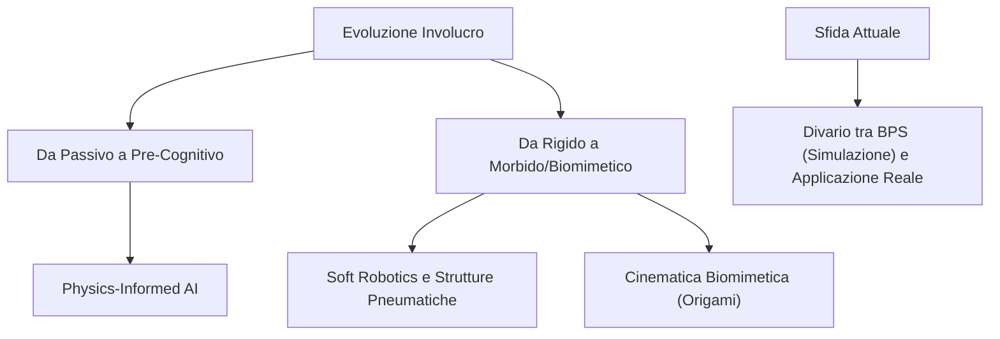

---
tags:
  - insight
---

# 👁️ Insight - Adaptive Envelopes

## 1. Oltre la Simulazione Statica
La letteratura contemporanea (2024-2026) evidenzia un cambio di paradigma radicale nell'interpretazione degli "involucri". Non più schermi passivi simulati con file meteo storici (EPW), ma sistemi reattivi "Location-Aware". La variabilità del cambiamento climatico costringe a usare l'intelligenza artificiale per prevedere in tempo reale i microclimi. L'involucro diventa un sistema pre-cognitivo in grado di anticipare i carichi termici.

## 2. Il Limite dei Modelli Generativi: Physics-Informed AI
L'ascesa dei Foundation Models (LLMs e IA Generativa Multi-Modale) rischia di portare a "allucinazioni progettuali" prive di base fisica. L'insight trasversale più rilevante è la necessità di ancorare le reti neurali ai principi termodinamici (Physics-Informed Neural Networks). Solo così l'involucro progettato dall'AI sarà costruibile ed energeticamente bilanciato.

## 3. Il Divario Tecnologico delle Facciate Cinetiche
Emerge una chiara discrepanza tra il potenziale teorico delle facciate adattive (ampio utilizzo di software BPS) e la loro effettiva integrazione commerciale su vasta scala. La comprensione del comportamento termico reale nel ciclo di vita e l'ibridazione ottimale con sistemi BIPV (fotovoltaico integrato) richiedono ancora transizioni da test isolati a dimostratori operativi.

## 4. Oltre i Materiali Rigidi: Soft Robotics
Il concetto di facciata sta sfidando i materiali tradizionali (vetro, acciaio) adottando logiche proprie della robotica morbida (soft robotics). Strutture interattive pneumatiche (realizzate con pellicole leggere come l'LDPE o elastomeri) dimostrano come lo spazio possa essere ingegnerizzato per gonfiarsi e variare di volume in tempo reale, negoziando fisicamente lo spazio con l'utente e influenzandone la prossemica psicologica.

## 5. Biomimetica Applicata e Cinematica
Il superamento dell'efficienza energetica passa spesso per processi di astrazione biomimetica. L'analisi funzionale della natura (es. la cinematica pieghevole delle ali degli insetti testata tramite logiche origami) si sta rivelando un framework robusto per progettare frangisole e pelli cinetiche, benché l'affaticamento e la deformazione plastica continua dei materiali (material fatigue) rimangano uno degli scogli principali da superare ingegneristicamente.

## 6. Circular Economy e BIPV Stand-alone
L'uso di attuatori meccanici costosi ed energivori sta lasciando il passo a componenti autosufficienti e a strutture biodegradabili o in filati mono-materiale CNC, massimizzando il potenziale di adaptive reuse. I sistemi BIPV non sono più solo generatori passivi, ma motori di dispiegamento per l'involucro stesso (es. sistemi SLICE), accorciando i tempi di ritorno dell'investimento (ROI).

## 7. Model Predictive Control (MPC) e Digital Twin
Stiamo assistendo al superamento delle logiche if-then reattive. Tramite framework IoT avanzati e simulazioni olistiche in tempo reale, i sistemi adattivi divengono precognitivi e comunicano con macchine CNC "Fabrication-Aware" ottimizzando ogni fase: dalla produzione customizzata all'ombreggiamento urbano avanzato.

## 8. Validazione Pratica tramite Modelli Termici RC e LSTM
La transizione dalla teoria all'applicazione richiede un testing software robusto prima del deploy su hardware Edge (es. moduli ESP32). Attraverso lo sviluppo di prototipi IoT in locale, si è dimostrato che l'impiego di dataset sintetici per il pre-training di reti LSTM (abbinate ad Attention Mechanism) è una strategia efficiente per sviluppare il Proof of Concept di un involucro precognitivo in assenza di uno storico meteorologico annuale. Per validare correttamente l'efficienza dei KPI di comfort (es. la stabilizzazione del Delta T interno), è emersa la necessità di abbandonare simulazioni di dati "piatti" o irrealistici in favore di Modelli Termici Equivalenti (Circuito RC) che ricalcolino dinamicamente la fluttuazione termica indoor in risposta al movimento cinematico dell'involucro.
