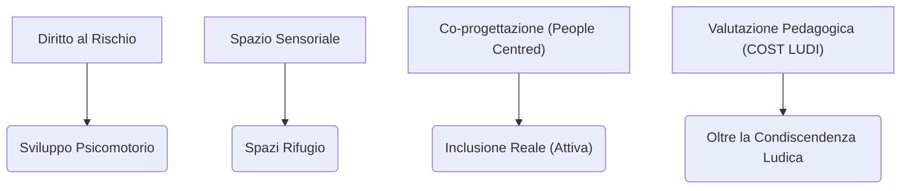

---
tags:
  - insight
  - parchi_gioco
  - universal_design
---

# 🧠 Insight Trasversali: Parchi gioco inclusivi

*Questa nota consolida le tendenze, i nodi critici e l'evoluzione dei paradigmi emersi dall'analisi delle fonti sul tema dei parchi gioco e degli spazi aperti inclusivi.*

## 1. Evoluzione del Paradigma: Dall'Accessibilità all'Inclusione Attiva
L'insight più ricorrente e trasversale (confermato da L'abilità Onlus, Fiaschi, Segalerba) è lo slittamento semantico e operativo dal concetto di "Accessibilità" a quello di "Inclusione". 
In passato, progettare un parco per disabili significava posizionare una rampa o un'altalena speciale. Oggi (approccio Universal Design e ICF), si riconosce che:
- Un gioco "speciale" crea un ghetto ("Il Paradosso dell'Altalena per Carrozzine").
- L'accessibilità spaziale è solo un "prerequisito". L'inclusione reale avviene solo se il parco diventa un palcoscenico per "attività umane condivise" (corsi, eventi, gioco libero non normato).
- **Contraddizione Rilevata:** Le istituzioni spesso si fermano all'adeguamento normativo (es. PEBA), ignorando che la mancanza di attivazione sociale rende l'investimento infrastrutturale inutile ai fini dell'inclusione sociale.

## 2. Il "Diritto al Rischio" vs "Iper-protezionismo"
Un dibattito centrale riguarda il bilanciamento tra sicurezza (Safe Spaces) e la necessità di uno spazio "dolcemente accidentato" (Schenetti).
- **Tendenza:** L'iper-protezionismo (spazi gommosi, recinzioni, assenza di dislivelli) limita lo sviluppo psicomotorio e cognitivo, specialmente dei bambini con disabilità che hanno ancor più bisogno di sperimentare i propri limiti.
- **Soluzione Emergente:** L'Outdoor Education e l'Embodied Cognition dimostrano che il rischio calcolato è formativo. La sicurezza vera non si ottiene con le recinzioni, ma tramite il controllo sociale informale (*Eyes on the Street*, Jacobs/Fiaschi).

## 3. L'Invisibilità delle Disabilità Sensoriali e Cognitive (Neurodivergenza)
Mentre la disabilità motoria trova sempre più risposte (rampe, pavimenti antitrauma continui), le disabilità cognitive (es. spettro autistico) e sensoriali restano le più svantaggiate.
- **Nodi Critici:** I parchi gioco sono spesso ambienti caotici, rumorosi e iper-stimolanti, che causano *Sensory Overload* (sovraccarico sensoriale) e *meltdown* in soggetti neurodivergenti.
- **Soluzioni Progettuali Emergenti (Segalerba):** L'introduzione del "Wayfinding Multisensoriale" (usare l'acqua o la vegetazione per orientare acusticamente/olfattivamente) e, soprattutto, la creazione di "Spazi Rifugio". Questi ultimi sono piccole tane silenziose o *quiet room* all'aperto, essenziali per permettere la decompressione senza costringere la famiglia ad abbandonare il parco.

## 4. Design Ostile e False Inclusioni
L'analisi ha evidenziato come alcune soluzioni presentate come "inclusive" celino in realtà intenti di segregazione o controllo sociale (Design Ostile).
- **Esempio emblematico:** Il "Paradosso della Panchina Inclusiva" (Tatano), in cui lo spazio "vuoto" lasciato per la carrozzina al centro della panchina divide le persone, invece di unirle, e i braccioli, giustificati per agevolare l'alzata degli anziani, vengono in realtà usati per impedire ai senzatetto di sdraiarsi (architettura anti-bivacco).

## 5. Il Valore Generativo della Co-Progettazione (Partecipazione dal Basso)
Sia nel caso del "Parco Libera Tutti" a Certaldo, nell'Aula all'aperto in via Polesine (Milano), sia nel vasto "Parco delle Carpugnane" (Calenzano), emerge che la "Progettazione Partecipata" non è solo un metodo di raccolta dati, ma una leva strategica per creare comunità. Abbracciando la **Progettazione People Centred** e l'**Ergonomia per il Design**, i cittadini se ne sentono proprietari (bene comune), prevenendo vandalismi e garantendo l'attivazione a lungo termine dello spazio relazionale.

## 6. Oltre la "Condiscendenza Ludica": La Valutazione del Gioco
L'approccio puramente architettonico non basta. Recenti studi pedagogici (Besio & Bianquin) evidenziano un grave difetto educativo: la *Condiscendenza Ludica*. Creare spazi accessibili e limitarsi a "lasciar giocare" i bambini, specie se disabili, non stimola il loro sviluppo. Si rende necessario il passaggio a un rigoroso **Play Assessment** (come il Modello COST LUDI) che misuri le reali competenze ludiche del bambino (e non solo le abilità cliniche) per poter strutturare l'ambiente in modo da attrarlo nella sua zona di sviluppo prossimale.

## Prospettive Future
Il parco gioco inclusivo del futuro non è un insieme di attrezzature specialistiche in un'area delimitata, ma un "sistema diffuso" e destrutturato che dialoga con la città. Si passa da un'idea di "protezione della disabilità" a una di "celebrazione della diversità", dove il gioco diventa il medium universale e le competenze ludiche vengono intenzionalmente accresciute.
