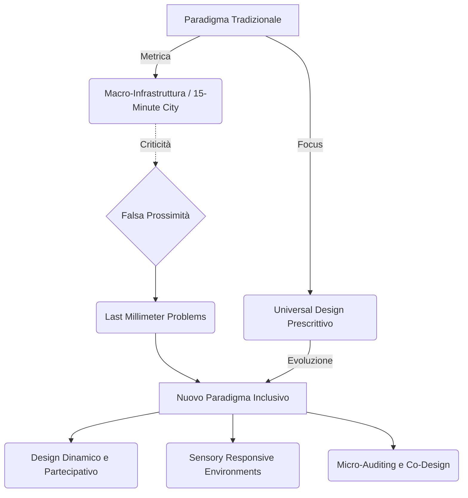

---
tags:
  - insight
  - sintesi
aliases:
  - Insight Architettura e Urbanistica Inclusiva
---

# 🧠 Insight - Sulla disabilità (Architettura e Urbanistica)

## 📌 Tendenze Emergenti
Dall'analisi delle fonti più recenti sull'ambiente costruito emergono tre tendenze fondamentali:
1. **Dalla Prossimità Teorica all'Accessibilità Reale:** Concetti di grande successo come la "Città dei 15 Minuti" stanno subendo una profonda revisione critica. Le isocrone calcolate su una persona normodotata (1.2 m/s) generano un fenomeno di **falsa prossimità** per le persone con disabilità visiva (0.8 m/s) o motoria (0.6 m/s). 
2. **Attenzione ai "Last Millimeter Problems":** L'urbanistica sta spostando il focus dalla macro-infrastruttura ai micro-ostacoli. Un intero quartiere accessibile viene invalidato dalla presenza di neve su una rampa, da un dislivello non segnalato o dalla mancanza di superfici tattili, evidenziando limiti di "abilismo urbano" nelle metriche standard come il Walk Score.
3. **Neuro-inclusione e Sensory Responsive Environments:** Oltre alle barriere fisiche, cresce l'attenzione per le barriere sensoriali e cognitive (autismo, ADHD). Il framework SREF promuove l'uso di "spazi di rifugio" e biofilia per mitigare il sovraccarico sensoriale urbano (rumore, illuminazione artificiale).

## ⚡ Contraddizioni e Conflitti tra Autori / Modelli
Il conflitto principale riscontrato riguarda la progettazione delle **Shared Streets** (strade condivise). Mentre l'eliminazione dei marciapiedi rialzati è vista come un trionfo per l'inclusione delle sedie a rotelle e la riduzione del traffico veicolare, per le persone cieche o ipovedenti rappresenta un disorientamento critico, in quanto viene rimosso il cordolo tattile di sicurezza. L'installazione di Superfici Tattili di Allerta (TWSI) è ostacolata in contesti storici (per vincoli UNESCO) e resa inefficace dalle condizioni climatiche (es. neve).

## 🚀 Evoluzione del Paradigma
Si sta passando da un **Universal Design prescrittivo** (che impone standard uguali per tutti) a un **Design Dinamico e Partecipativo**, che accetta soluzioni ibride e flessibili. L'uso di tecnologie beacon, il co-design diretto con gli utenti e l'auditing partecipativo crowdsourced si impongono come gli unici strumenti in grado di risolvere i complessi "trade-off" tra diverse disabilità.
