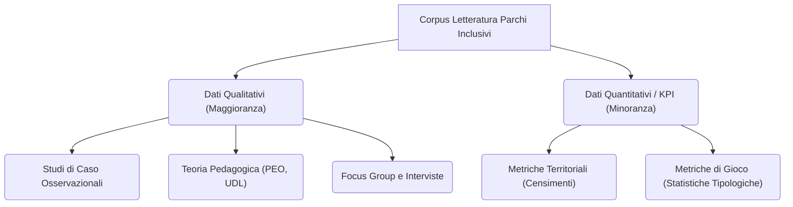

---
tags:
  - approfondimento
  - kpi
  - audit
  - parchi_gioco
---

# 📊 KPI Audit: Maturità dei Dati nei Parchi Inclusivi

Questo documento presenta l'audit della maturità dei dati quantitativi presenti nel corpus bibliografico relativo ai parchi gioco inclusivi. L'obiettivo è separare la speculazione teorico-qualitativa dalle evidenze metriche (KPI) effettivamente misurate.

## 1. Analisi della Maturità del Corpus

L'interrogazione sistematica delle fonti ha rivelato una fortissima **preponderanza di letteratura qualitativa e teorica**. La maggior parte dei paper non riporta KPI sperimentali diretti (es. riduzione percentuale dello stress neurodivergente, aumento misurato del tempo di permanenza), ma si affida a framework teorici e studi di caso narrativi.

Questo evidenzia una bassa "maturità dei dati" in questo specifico settore di ricerca, che risulta ancora sbilanciato verso la sociologia, la pedagogia e l'attivismo sociale, piuttosto che verso il data-driven design architettonico.

## 2. KPI e Metriche Estratte (Ground Truth)

Nonostante la carenza generale, l'Audit ha isolato alcune metriche quantitative solide che fungono da baseline per lo stato dell'arte:

1. **Metriche Territoriali (Gap Strutturale):** 
   - Secondo i dati del 2015, si contavano a malapena **30 parchi inclusivi** in tutta Italia, e circa 50 parchi contenenti "solo due o tre giochi accessibili" (*Fonte: Creare l'inclusivita TO e parchi giochi*). Questo KPI dimostra la profonda arretratezza infrastrutturale del decennio scorso.
2. **Metriche Ludico-Tipologiche (Ludodiversità):** 
   - L'analisi sui giochi tradizionali (spesso soppiantati dai giochi a catalogo dei parchi moderni) evidenzia che l'**85%** di essi sono giochi puramente motori e il **45%** prevedono un approccio intrinsecamente intergenerazionale (*Fonte: Pedagogia del gioco il gioco inclusivo*). Questo KPI giustifica la necessità di reintrodurre dinamiche "Play" destrutturate per attrarre adulti e bambini simultaneamente.

## 3. Matrice dell'Audit

Di seguito, un riepilogo a campione della maturità dei dati estratti da alcuni dei paper principali:

| Fonte | Tipologia di Ricerca | KPI / Metriche Quantitative Rilevate |
| :--- | :--- | :--- |
| [[Paper - Creare l'inclusivita TO e parchi giochi]] | Revisione / Caso Studio | **Sì** (30 parchi inclusivi in Italia al 2015) |
| [[Paper - Pedagogia del gioco il gioco inclusivo]] | Analisi Tipologica | **Sì** (85% giochi motori; 45% intergenerazionali) |
| [[Paper - Il Gioco come ponte sociale]] | Revisione Pedagogica | Nessuno (Qualitativo) |
| [[Paper - Parchi giochi e CAM (Mezzalana et al.)]] | Tecnico / Normativo | Nessuno (Focus normativo qualitativo sui CAM) |
| [[Paper - Spazi verdi accessibili e inclusivi (Fiaschi)]] | Osservazionale | Nessuno (Qualitativo) |
| [[Paper - Configurazione multisensoriale della stanza all'aperto (Segalerba)]] | Progetto Accademico | Nessuno (Qualitativo / Applicazione Framework) |

## 4. Conclusioni e Sviluppi Futuri

Per elevare la scientificità della progettazione inclusiva, le future ricerche e le co-progettazioni sul campo dovranno integrare **sensori ambientali, mappature termiche e tracking visivo/pedonale** per generare KPI sperimentali reali, colmando il gap tra la teoria dell'Universal Design e la misurazione effettiva dell'inclusione relazionale.
