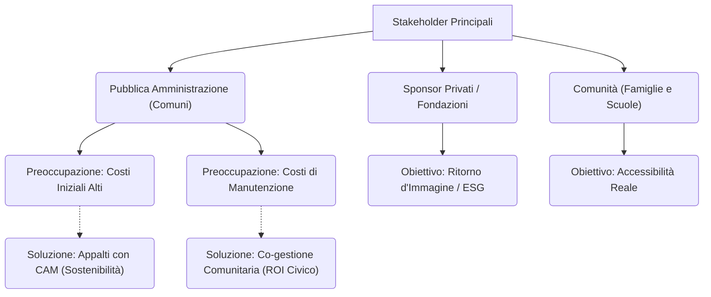

---
tags:
  - approfondimento
  - stakeholder
  - roi
  - parchi_gioco
---

# 🎯 Sintesi: Analisi Stakeholder e Sostenibilità Economica (ROI)

Questo documento traccia una mappa dei portatori di interesse (stakeholder) coinvolti nello sviluppo dei parchi gioco inclusivi, analizzando le loro principali resistenze e proponendo modelli di ritorno sull'investimento (ROI) civico ed economico.

## 1. Mappatura degli Stakeholder

Dall'analisi delle fonti (in particolare i progetti sistemici come *Gioco al Centro* e *Parchi per tutti*), emerge chiaramente che l'ostacolo principale all'inclusione non è la mancanza di tecnologia, ma la percezione del rischio economico da parte della Pubblica Amministrazione.

1. **Amministrazioni Locali (Comuni):** Sono l'attore decisore principale. Le loro metriche decisionali si basano storicamente sul rapporto tra **costo di installazione** e **costo di manutenzione**. Un parco "iper-strutturato" con giochi complessi a catalogo richiede standard di manutenzione altissimi (certificazioni, usura meccanica, rischio vandalismo).
2. **Enti del Terzo Settore / Sponsor:** Forniscono spesso il budget iniziale (Public-Private Partnership), ma faticano a garantire la gestione a lungo termine se il Comune non prende in carico l'infrastruttura.
3. **Cittadinanza Attiva:** Chiede spazi più flessibili e fruibili, ma spesso non viene coinvolta nella progettazione originaria, percependosi come mero "cliente" dello spazio pubblico e non come "custode".

## 2. Il Problema del ROI Tradizionale

I parchi inclusivi tradizionali (intesi come parchi classici a cui vengono aggiunti moduli speciali per disabili, es. l'altalena per carrozzine) presentano un **ROI economico percepito come negativo**:
- Elevato costo d'acquisto per l'equipaggiamento speciale.
- Uso esclusivo da parte di una minoranza (spesso recintato).
- Altissimo tasso di vandalismo per via dell'estetica ospedaliera e stigmatizzante.

## 3. Il Modello di ROI Civico e Sostenibilità Strategica

La letteratura propone un superamento di queste barriere economiche agendo su due fronti:

### A. Ritorno Sociale ed Economico tramite la Sostenibilità
L'adozione di un design orientato ai **CAM (Criteri Ambientali Minimi)** e all'**Universal Design for Learning** riduce l'impronta economica. Sostituire le costose strutture in plastica/metallo a catalogo con elementi topografici (collinette, tronchi, labirinti vegetali) abbatte radicalmente sia i costi di installazione sia quelli di revisione tecnica, azzerando le parti meccaniche soggette a rottura (*Nature Play*).

### B. Manutenzione Partecipata (Eyes on the street)
L'integrazione di processi di co-progettazione (dove scuole e quartiere disegnano il parco) genera un senso di appartenenza (*place attachment*). I casi studio dimostrano che i parchi co-progettati subiscono danni da vandalismo prossimi allo zero. La comunità diventa un alleato attivo nella manutenzione, trasformando una voce di costo per la PA in un asset di resilienza sociale (ROI Civico).
