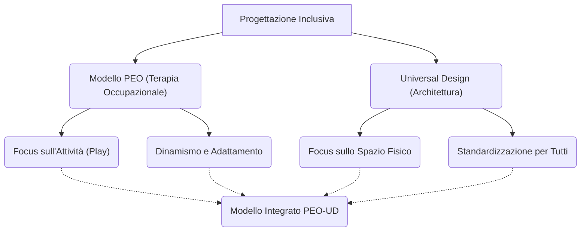

---
tags:
  - sintesi
  - approfondimento
  - framework
  - parchi_gioco
---

# 🔄 Sintesi: Confronto Modello PEO vs Universal Design

Questo approfondimento confronta criticamente due dei principali modelli teorici e metodologici emersi dalle fonti relative alla progettazione dei parchi gioco inclusivi: il **Modello PEO (Person-Environment-Occupation)** di matrice terapeutico-occupazionale e l'approccio dell'**Universal Design (UD)**, di derivazione architettonica e progettuale.

## 1. Punti di Convergenza e Divergenza

Sebbene entrambi i framework abbiano come obiettivo ultimo l'inclusione, i loro assunti di base e le loro applicazioni operative divergono in modo significativo:

- **Universal Design (UD):** Si concentra sull'**accessibilità come prerequisito**. Cerca di creare uno standard spaziale (strutture, pavimentazioni, percorsi) che possa accogliere la più ampia gamma possibile di abilità umane senza necessità di adattamenti speciali. Ha un'indole statica e focalizzata sull'infrastruttura.
- **Modello PEO:** Si concentra sull'**inclusione come attività**. Valuta l'adattamento (fit) tra le capacità del bambino (Person), l'area giochi (Environment) e il tipo di gioco che si sta svolgendo (Occupation). Ha un'indole dinamica, riconoscendo che uno spazio perfetto non garantisce il gioco se l'attività non è motivante o adeguata.

## 2. Matrice Comparativa

| Dimensione | Universal Design (UD) | Modello PEO (Person-Environment-Occupation) |
| :--- | :--- | :--- |
| **Origine Disciplinare** | Architettura, Ingegneria, Urbanistica | Terapia Occupazionale, Psicologia |
| **Oggetto Primario** | L'ambiente fisico (strutture, percorsi, barriere) | L'interazione dinamica Persona-Ambiente-Attività |
| **Obiettivo Operativo** | Massimizzare l'accessibilità spaziale per tutti | Ottimizzare la performance occupazionale (il "Giocare") |
| **Fattore Critico** | Le specifiche tecniche a norma (PEBA, rampe, spazi ampi) | La motivazione intrinseca e l'equilibrio della sfida ludica |
| **Punto di Forza** | Garantisce l'ingresso e l'usabilità di base per chi ha disabilità motorie/visive | Valuta l'effettiva partecipazione sociale e relazionale |
| **Limite (Gap Rilevato)** | Rischia di standardizzare il gioco, abbassando la sfida (noia) | Complesso da tradurre in metriche costruttive per gli architetti |

## 3. Verso un Modello Integrato

La letteratura dimostra che l'Universal Design, se applicato in modo puramente ingegneristico, rischia di generare il paradosso della "panchina inclusiva", risolvendo il problema fisico ma mancando l'attivazione ludica. 

Un **Modello Integrato** fonde i punti di forza di entrambi:
1. **L'UD definisce l'Hardware:** Le pavimentazioni antitrauma, le rampe, e gli spazi rifugio creano il layer di sicurezza e accessibilità.
2. **Il PEO definisce il Software:** Il design dei giochi stessi (la sfida, le affordance, i materiali non strutturati) viene calibrato per stimolare l'occupazione (il *Play* e non solo il *Game*), garantendo la zona di sviluppo prossimale per bambini neurotipici e neurodivergenti.

Questa fusione permette di passare da un "parco accessibile" (dove tutti possono entrare) a un "parco inclusivo" (dove tutti trovano un motivo significativo per restare e giocare insieme).
