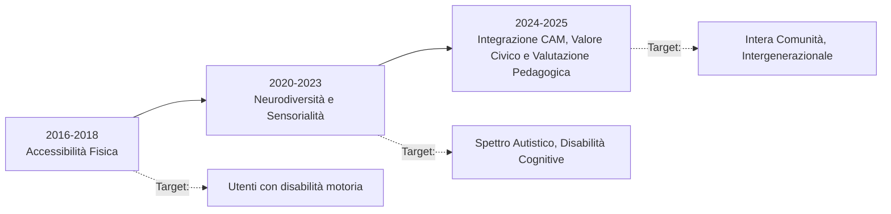

---
tags:
  - approfondimento
  - evoluzione
  - trend
  - parchi_gioco
---

# ⏳ Sintesi: Evoluzione del Paradigma Inclusivo (2016-2025)

L'analisi cronologica della letteratura sui parchi gioco inclusivi mostra un profondo slittamento teorico e applicativo nel decennio 2016-2025. Il concetto di "inclusione" si è trasformato da una mera ottemperanza normativa per la disabilità fisica a una visione sistemica di ecologia sociale.

## FASE 1 (2016 - 2018): Il Paradigma Medico e l'Accessibilità

Nelle prime pubblicazioni del corpus (es. *Creare l'inclusività TO e parchi giochi, 2016*; *Inclusione 3.0, 2018*), il focus è quasi esclusivamente **tecnico-riabilitativo**.
L'inclusione viene intesa come l'eliminazione fisica delle barriere (PEBA). L'attenzione dei progettisti è rivolta alle carrozzine, all'inserimento di pavimentazioni antitrauma in gomma colata e alla creazione di giochi ad hoc (l'altalena per disabili). È la fase della "riparazione" in cui lo spazio pubblico cerca di adattarsi alle normative base.

## FASE 2 (2020 - 2023): La Svolta Neurosensoriale e il Diritto al Rischio

Nel triennio post-pandemico (es. *Progetto Giochi sensoriali in condivisione, 2020*; *Panchine per tutti, 2023*), la letteratura inizia a criticare i parchi realizzati nella fase precedente, accusati di essere "isole stigmatizzanti" e incredibilmente noiosi per i bambini normodotati a causa dell'eccessivo appiattimento del rischio.
L'attenzione si sposta verso:
1. **Neurodivergenza:** Si introducono concetti come il *Sensory Overload* (sovraccarico sensoriale) e si teorizza la necessità di "Spazi Rifugio" per i bambini autistici.
2. **Diritto al Rischio:** Si afferma il valore del rischio calcolato nello sviluppo psicomotorio. L'inclusione non significa "azzerare la sfida", ma fornire percorsi a difficoltà graduata (Zona di Sviluppo Prossimale).

## FASE 3 (2024 - 2025): L'Ecologia Sociale, L'Ergonomia e la Valutazione Pedagogica

Negli studi più recenti (es. *Parchi giochi e CAM, 2025*; *Valutare l'evoluzione del gioco, 2025*; *Design, inclusione e sviluppo sostenibile*), il concetto di inclusione esce dall'alveo puramente assistenziale e si fonde con la **transizione ecologica, l'Ergonomia per il Design e la pedagogia strutturata**.
- **Sostenibilità Normata (CAM) ed Ergonomia:** L'inclusività entra nei Criteri Ambientali Minimi per gli appalti pubblici. La progettazione si fa *People Centred*, integrando aspetti cognitivi, percettivi ed emotivi per anticipare come utenti diversi interagiranno con lo spazio.
- **Valutazione del Gioco (Play Assessment):** A livello pedagogico, si critica aspramente l'atteggiamento di "Condiscendenza Ludica" (lasciar semplicemente giocare i bambini in spazi sicuri). Si afferma l'esigenza di misurare le reali abilità ludiche (Modello COST LUDI) per raggruppare i bambini per competenze e non per età o diagnosi clinica.
- **Ponte Sociale e Smart Tech:** Il parco viene riconosciuto non come un recinto per bambini, ma come un hub civico capace di integrare diverse etnie e facilitare il dialogo intergenerazionale. Le prospettive 2025 puntano all'uso di tecnologie smart (APP di feedback, sensori ambientali) per un monitoraggio continuo post-operam. 
