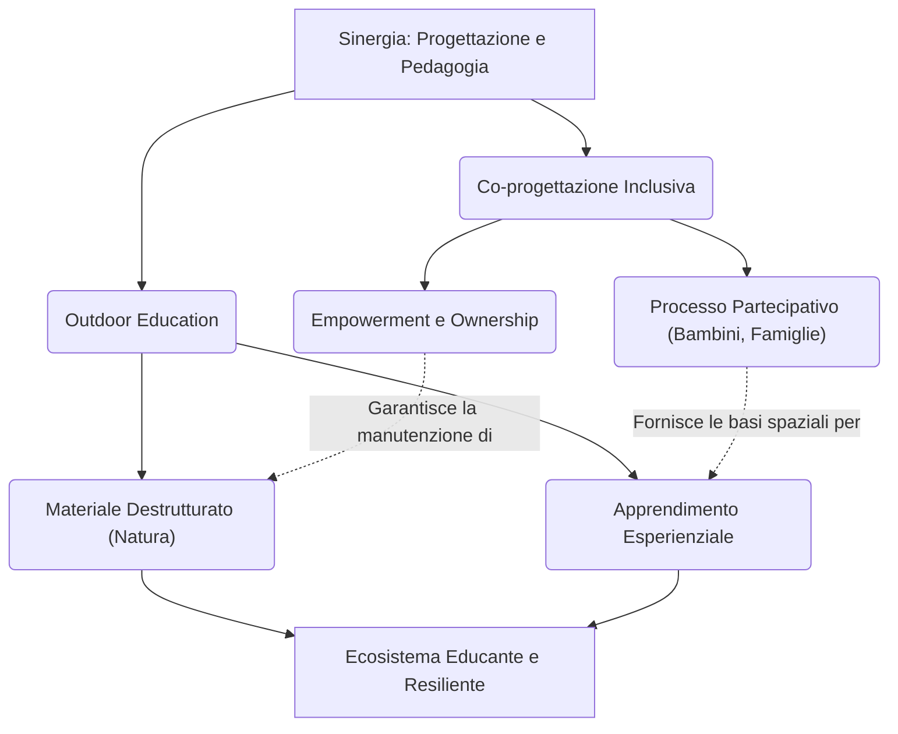

---
tags:
  - approfondimento
  - sinergia
  - coprogettazione
  - outdoor_education
  - parchi_gioco
---

# 🔗 Sintesi: Sinergia tra Co-progettazione e Outdoor Education

Questa nota di sintesi esplora la cross-pollination teorica e pratica tra due concetti fondamentali emersi dall'analisi del Vault: la **[[Concept - Co-progettazione inclusiva|Co-progettazione Inclusiva]]** e l'**[[Concept - Outdoor Education come Strumento di Inclusione|Outdoor Education]]**. La loro intersezione definisce il passaggio da uno spazio puramente fisico a un vero e proprio "ecosistema educante".

## 1. Il Terreno Comune

Sia la co-progettazione che l'educazione all'aperto condividono un assunto di base rivoluzionario rispetto alla visione tradizionale del parco giochi: **l'utente finale (il bambino, con o senza disabilità) non è un fruitore passivo, ma un agente attivo capace di modificare lo spazio e di trarne significato.**

- Nella **Co-progettazione**, i bambini vengono interpellati (tramite focus group o laboratori, come visto nei progetti di *Milano* e dell'*Emilia Romagna*) per definire quali sfide ludiche desiderano affrontare. Questo abbatte il "rischio adulto" di creare parchi iper-protettivi ma sterili.
- Nell'**Outdoor Education**, lo spazio all'aperto non è solo il luogo della ricreazione (sfogo fisico post-scuola), ma l'aula primaria. Qui, l'interazione con l'inaspettato e con la natura (acqua, sabbia, dislivelli) supporta le capacità cognitive e sensoriali.

## 2. La Sinergia Operativa

La vera forza (la *cross-pollination*) emerge quando i due concetti vengono applicati congiuntamente in un progetto architettonico:

1. **Dal Catalogo al Materiale Destrutturato:** La co-progettazione rivela invariabilmente che i bambini preferiscono giocare con elementi manipolabili (rametti, pietre, terra) piuttosto che con rigide strutture in plastica. L'Outdoor Education teorizza pedagogicamente questo bisogno, dimostrando che il [[Concept - Materiale ludico non strutturato|materiale non strutturato]] è il più inclusivo in assoluto, poiché non ha un "modo giusto" di essere usato e non discrimina i bambini neurodivergenti o con ritardi motori.
2. **Il Superamento della Standardizzazione:** Co-progettare significa radicare il parco nella sua specifica comunità. Un parco basato sull'Outdoor Education sfugge alla logica "copia-incolla" dell'Universal Design più normativo, per diventare un progetto paesaggistico unico (es. collinette per rotolare, nascondigli di salici), rispondendo al bisogno di [[Concept - Spazi Rifugio per la Neurodivergenza|spazi rifugio]] emerso dai laboratori partecipati.
3. **Appropriazione Spaziale:** Un parco fortemente naturale richiede manutenzione e cura. La co-progettazione agisce come attivatore sociale: chi ha progettato il parco (le scuole locali, i comitati di quartiere) se ne sente proprietario, proteggendolo dal degrado.

## 3. Conclusione: L'Architettura Pedagogica

I due concetti, fondendosi, suggeriscono ai progettisti urbani una nuova modalità di intervento: il designer non dovrebbe più disegnare un prodotto finito (il parco "chiavi in mano"), ma disegnare **un'infrastruttura aperta e imperfetta**, che verrà continuamente completata e reinterpretata dai bambini attraverso le dinamiche dell'educazione all'aperto.
