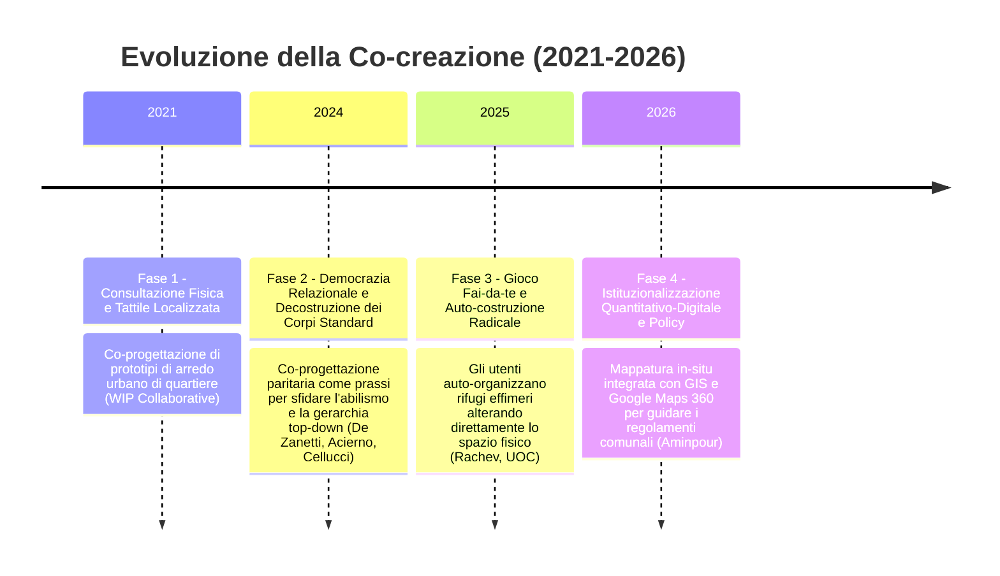

---
tags:
  - synthesis
  - neuroinclusione
  - evoluzione-paradigma
taccuino: "[[Notebook - Spazi Aperti Neuroinclusivi]]"
modalita: "Analisi del Trend Temporale ed Evoluzione del Paradigma (Modalità 9)"
ultimo_aggiornamento: 2026-05-23
---

# 📑 Sintesi: Trend Temporale ed Evoluzione della Co-creazione

## 🎯 Obiettivo dell'Analisi
Lo scopo di questa sintesi è applicare la **Modalità 9 (Analisi del Trend Temporale ed Evoluzione del Paradigma)** al concetto chiave di **[[Concept - Co-creation|Co-creation (Co-creazione)]]** all'interno del taccuino **Spazi Aperti Neuroinclusivi**. 

L'analisi traccia un arco temporale di 5 anni (dal 2021 al 2026) per mappare come la progettazione partecipata con persone neurodivergenti si sia evoluta: da una pratica pionieristica e localizzata di consultazione fisica ad una metodologia di ricerca-azione quantitativo-digitale, fino a giungere a forme radicali di auto-costruzione e rivendicazione politica informale.

---

## 📈 L'Arco Evolutivo del Paradigma (2021-2026)

L'evoluzione temporale del concetto di co-creazione si articola in quattro fasi storiche distinte:

---

## 🔍 Analisi Dettagliata delle Fasi Evolutive

### Fase 1 (2021): La Co-creazione come Consultazione Fisica Localizzata
* **Contesto ed Evidenze:** All'avvio del paradigma, il lavoro fondamentale di **WIP Collaborative (2021)** introduce la co-creazione per contrastare la cecità sensoriale dello spazio pubblico di New York. La metodologia si concentra su workshop site-specific con *self-advocates* autistici per progettare prototipi di arredo urbano tattile a Louise Nevelson Plaza.
* **Caratteristiche:** La co-creazione è intesa principalmente come **consultazione e co-design fisico di micro-affordance** (sedute protette, materiali caldi), focalizzandosi sulla scala del quartiere e sulla prototipazione temporanea a basso costo.
* **Riferimenti nel Vault:** [[Paper - WIP Collaborative (2021) - The Neurodiverse City]], [[Concept - Self-advocates]].

### Fase 2 (2024): La Co-creazione come Democrazia Relazionale e Politica
* **Contesto ed Evidenze:** Con la maturazione della letteratura, la co-creazione si espande in una dimensione sociologica e filosofica. **De Zanetti (2024)** ed **Acierno (2024)** inquadrano la co-progettazione non come un semplice strumento tecnico, ma come una **prassi democratica paritaria** fondamentale.
* **Caratteristiche:** Si scardina radicalmente la gerarchia progettuale calata dall'alto (*top-down*). La co-creazione diventa lo strumento primario per riconoscere la dignità dell'esperienza vissuta (*lived experience*) e per sfidare lo standard corporeo e cognitivo "normativo" (abilismo spaziale), saldandosi con il concetto etico di Giustizia Spaziale.
* **Riferimenti nel Vault:** [[Paper - De Zanetti (2024) - Identita Neurodivergente]], [[Paper - Acierno (2024) - Diritto alla Citta]], [[Concept - Giustizia Spaziale]].

### Fase 3 (2025): L'Auto-costruzione Radicale e il Gioco Informale (DIY)
* **Contesto ed Evidenze:** Si registra una rottura epistemologica con i modelli di co-creazione istituzionali. **Rachev et al. (2025)** e gli studi del living lab **UOC (2025)** introducono pratiche di gioco auto-organizzato e transitorio (*DIY play*).
* **Caratteristiche:** La co-creazione non è più una "seduta di workshop" facilitata da architetti all'interno di uno studio. Diventa un'azione materiale e corporea in cui bambini autistici e adulti neurodivergenti **auto-costruiscono i propri habitat sensoriali e rifugi effimeri** (*shelter-making*) utilizzando materiali di scarto direttamente nei parchi pubblici. Il designer assume il ruolo di mero facilitatore di flussi materiali, lasciando l'agency spaziale interamente in mano all'utente.
* **Riferimenti nel Vault:** [[Paper - Rachev (2025) - DIY Play and Neuro-Non-Typical Urbanism]], [[Paper - UOC (2024) - ASD Publics Friendly Design]], [[Casestudy - Play AUT the Box]].

### Fase 4 (2026): L'Istituzionalizzazione e la Policy Quantitativo-Digitale
* **Contesto ed Evidenze:** Nelle pubblicazioni più recenti, guidate dal report UNSW di **Aminpour et al. (2026)**, la co-creazione partecipata compie un salto di scala, integrando tecnologie digitali e puntando alla trasformazione delle politiche pubbliche metropolitane.
* **Caratteristiche:** La lived experience viene formalizzata attraverso interviste strutturate basate su walking-tour in-situ (con rilievi acustici e fotografici in tempo reale) e indagini online quantitative interattive che sfruttano le immagini 360° di Google Maps. Il processo non punta più solo a creare installazioni temporanee, ma a fornire prove scientifiche solide per rafforzare e modificare in modo permanente le linee guida urbanistiche comunali (es. *City of Sydney's Inclusive Guidelines*).
* **Riferimenti nel Vault:** [[Paper - Aminpour (2026) - Towards Neuroinclusive Public Open Spaces]], [[Concept - Inclusion Infrastructure]].

---

## 🧠 Sviluppi e Tendenze Emergenti
Il trend evidenzia chiaramente che la co-creazione si sta evolvendo da un approccio **passivo-consultivo** a un modello **attivo-emancipativo**. Nello scenario futuro (2026 e oltre), il co-design neuroinclusivo dovrà necessariamente:
1. Superare la frammentazione dei singoli progetti pilota per integrarsi stabilmente nelle piattaforme digitali di e-governance comunale.
2. Integrare metodologie trans-specie (more-than-human), dove il processo di co-creazione include le risposte ecologiche della materia vegetale e biologica.

---

## 🔗 Ground Truth (Fonti e Prove)
*Riferimenti diretti alle note del Vault che validano l'analisi evolutiva:*
- [[Paper - WIP Collaborative (2021) - The Neurodiverse City]] — *Fase 1 (Consultazione micro-spaziale).*
- [[Paper - De Zanetti (2024) - Identita Neurodivergente]] — *Fase 2 (Intersoggettività e democrazia relazionale).*
- [[Paper - Rachev (2025) - DIY Play and Neuro-Non-Typical Urbanism]] — *Fase 3 (Gioco DIY e auto-costruzione).*
- [[Paper - Aminpour (2026) - Towards Neuroinclusive Public Open Spaces]] — *Fase 4 (Policy e digital mapping).*
- [[Concept - Co-creation]] — *Nota concettuale evolutiva del Vault.*

---
**Note:** Questa sintesi è stata generata tramite interrogazione avanzata della KB (Modalità 9).
