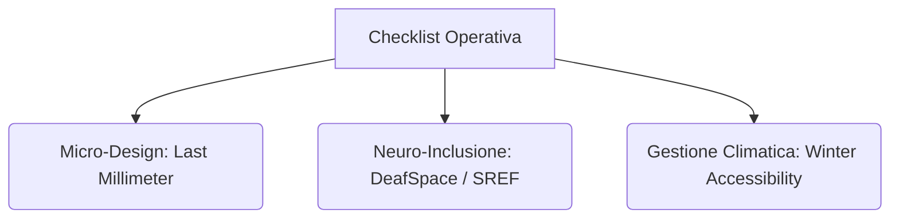

---
tags:
  - synthesis
  - analysis
  - checklist
taccuino: "Sulla disabilità"
modalita: "6"
ultimo_aggiornamento: 2026-06-07
---

# 📑 Sintesi: Checklist Operativa - Progettazione Architettonica Inclusiva

## 🎯 Obiettivo dell'Analisi
Fornire ai progettisti, urbanisti e architetti uno strumento operativo concreto (Checklist) basato sull'evidenza scientifica estratta. Questa linea guida traduce le criticità sistemiche (abilismo urbano, falsa prossimità, conflitti sensoriali) in criteri progettuali validati per mitigare il "Last Millimeter Problem" e promuovere i "Sensory Responsive Environments".

## 📊 Risultati dell'Analisi (Linee Guida Operative)

### Fase 1: Auditing e Mappatura Preliminare
- [ ] **Mappatura Partecipativa ("Walkability a Velocità Ridotta"):** Integrare audit camminati con le persone disabili del quartiere. Non basarsi esclusivamente su algoritmi GPS che misurano le distanze a 1.2 m/s. Le tempistiche isocrone devono essere ri-calibrate su velocità di 0.6 - 0.8 m/s per garantire una reale prossimità.
- [ ] **Valutazione Stagionale ("Winter Accessibility"):** Testare l'accessibilità dei percorsi durante le stagioni avverse (es. accumuli di neve). Verificare che la rimozione della neve non blocchi mai le rampe di accesso pedonali e che le pavimentazioni tattili non diventino scivolose o coperte.

### Fase 2: Progettazione Fisica (Micro-Design dell'Ultimo Millimetro)
- [ ] **Gestione dei Cordoli nelle Shared Streets:** Se il cordolo viene eliminato per facilitare il passaggio delle sedie a rotelle, è *obbligatorio* installare **Superfici Tattili di Allerta (TWSI - Tactile Walking Surface Indicators)** o variazioni volumetriche chiare per indicare il confine sicuro di carreggiata ai non vedenti.
- [ ] **Continuità dei Riferimenti Tattili:** Sfruttare gli elementi architettonici (facciate continue degli edifici, muretti, linee di scolo o vegetazione delimitante) come guide tattili o sonore "naturali" per l'orientamento, evitando interruzioni improvvise nel tracciato urbano.
- [ ] **Rimozione Micro-Barriere ("Last Millimeter"):** Prestare estrema attenzione al raccordo terminale tra lo spazio pubblico e l'ingresso privato o ai nodi di trasporto (piccoli gradini non segnalati, porte manuali pesanti, pendenze irregolari).

### Fase 3: Progettazione Sensoriale e Cognitiva (Neuro-inclusione)
- [ ] **Spazi di Rifugio ("Refuge"):** Inserire regolarmente aree di "decompressione" sensoriale ai margini delle piazze ad alta densità o vicino a grandi arterie stradali, per permettere alle persone autistiche o con ADHD di isolarsi momentaneamente dal sovraccarico.
- [ ] **Zonizzazione Sensoriale (DeafSpace):** Assicurare linee visive sgombre per la comunicazione non verbale, illuminazione uniforme (anti-abbagliamento per facilitare la lettura labiale) e acustica assorbente per ridurre il rumore di fondo che interferisce con gli impianti acustici.
- [ ] **Contrasto Cromatico e Materiale:** Implementare variazioni di texture e colori ad alto contrasto senza pattern psichedelici che possano generare illusioni ottiche o confondere chi ha ipovisione o fragilità neurologica.

## 🧠 Insight Generati
1. **Dalla Strategia alla Tattica:** La vera inclusione si decide nel "micro-design". Un piano regolatore che teoricamente rispetta i parametri della Città dei 15 Minuti è reso inutile per un disabile motorio se l'accesso all'ultimo edificio manca della rampa (il "problema dell'ultimo millimetro").
2. **Risoluzione del Conflitto Inter-disabilità:** L'approccio vincente è il **compromesso multi-sensoriale**. Laddove un'agevolazione per una minoranza (es. pavimentazione a raso) crea un pericolo per un'altra (es. non vedenti), la soluzione architettonica richiede l'aggiunta di un ulteriore layer informativo (tattile/visivo) che avverta del rischio senza ripristinare la barriera fisica.

## 🔗 Ground Truth (Fonti e Prove)
- [[Paper - 15-minute cities, walkability and last millimeter problems]]
- [[Paper - Accessibility Challenges in the 15-Minute City Concept for People with Disabilities in Timisoara]]
- [[Paper - Enhancing shared street accessibility in heritage sites for individuals with visual disabilities]]
- [[Paper - Sensory Responsive Environments]]
- [[Concept - Last Millimeter Problems]]
- [[Concept - Sensory Responsive Environments]]
- [[Concept - Superfici Tattili di Allerta]]
- [[Concept - DeafSpace]]

---
**Note:** Questa sintesi è stata generata tramite interrogazione avanzata della KB (Modalità 6).
