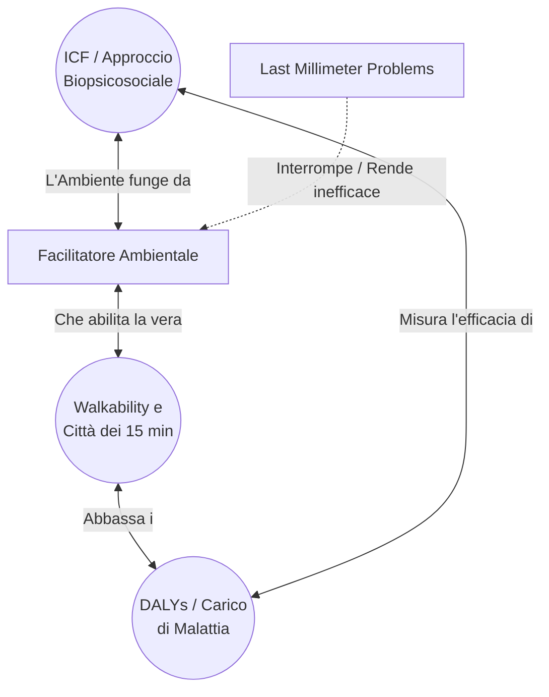

---
tags:
  - synthesis
  - cross-pollination
  - approfondimento
ultimo_aggiornamento: 2026-06-08
---

# 🔗 Cross-Pollination: Sinergie Concettuali e Walkability

## Sintesi dell'Analisi (Modalità 10)
Scansionando le note concettuali del taccuino "Sulla disabilità", è emersa una fitta rete di connessioni (cross-pollination) attorno a specifici cluster semantici. I concetti che presentano il più alto grado di condivisione di fonti (tra le 5 e le 8 fonti in comune) sono:
1. **[[Modello Biopsicosociale (ICF)]] / Approccio Biopsicosociale**
2. **[[Concept - Facilitatori Ambientali]]**
3. **[[Concept - Barriere Architettoniche definizioni]]**
4. **[[Linguaggio e Disabilità]]**

Dall'intersezione di questi e altri nodi concettuali secondari (come *Walkability*, *Città in 15 Minuti* e *DALYs*), emergono due forti sinergie teoriche e applicative.

### Sinergia 1: L'ICF come ponte tra Clinica e Urbanistica
Il concetto di *Approccio Biopsicosociale* (ICF) non è più limitato alle scienze riabilitative o pediatriche. I dati mostrano che esso condivide le stesse fonti letterarie con le definizioni spaziali (Barriere e Facilitatori Ambientali). 
La sinergia si concretizza in un cambio di paradigma: la salute e il funzionamento di un individuo non dipendono solo dalla sua *Intrinsic Capacity*, ma dalla presenza massiccia di **Facilitatori Ambientali**. L'ambiente costruito smette di essere lo sfondo dell'azione e diventa l'interfaccia primaria. In questo senso, l'adozione dell'ICF da parte di architetti e policy-maker permette di progettare spazi urbani che fungono da veri e propri "farmaci" spaziali, compensando le menomazioni cliniche.

### Sinergia 2: La Decostruzione della Walkability e l'Ineguaglianza Spaziale
Un secondo cluster forte lega concetti urbani innovativi come [[Concept - Città dei 15 Minuti]], [[Concept - Walkability]], e [[Concept - Last Millimeter Problems]], a concetti socio-epidemiologici come i determinanti sociali della salute e il carico di malattia (DALYs).
La connessione profonda rivela l'illusione della "Falsa Prossimità": la metrica della distanza (i 15 minuti) è abilista se non è accoppiata alla metrica della percorribilità senza sforzo. Questa discordanza crea quella che la letteratura definisce *Activity Inequality* (ineguaglianza nell'attività fisica). Risolvere il problema dell'ultimo millimetro (es. rimuovendo i cordoli e curando l'illuminazione sensoriale) è essenziale affinché i modelli sostenibili come la *Shared Street* non diventino vere e proprie trappole per le vulnerabilità visive e motorie.

## Conclusioni Operative
L'integrazione di questi concetti suggerisce che nessuna politica di sostenibilità urbana (Walkability, 15-Minute City) può dirsi completa senza essere valutata attraverso l'asse dell'ICF. L'adozione di un vocabolario comune (*Linguaggio della disabilità*) tra urbanisti, sanitari e decisori politici è il primo passo per trasformare le astrazioni del design sostenibile in *Facilitatori Ambientali* concreti e misurabili, in grado di abbassare efficacemente gli anni vissuti con disabilità (YLDs).

## Ground Truth (Fonti Principali)
- [[Paper - An overview of systematic reviews to determine the impact of socio environmental factors on health outcomes]]
- [[Paper - Longitudinal trajectories of intrinsic capacity]]
- [[Paper - 15-minute cities, walkability and last millimeter problems]]
- [[Paper - Accessibility Challenges in the 15-Minute City Concept for People with Disabilities in Timisoara]]
- [[Paper - Matching barriers and facilitators to implementation strategies]]
