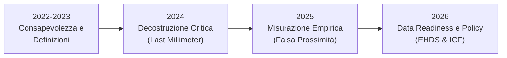

---
tags:
  - synthesis
  - trend-temporale
  - approfondimento
ultimo_aggiornamento: 2026-06-08
---

# 🕒 Evoluzione Temporale del Paradigma: Sulla disabilità (2022-2026)

## Sintesi dell'Analisi (Modalità 9)
L'analisi cronologica delle fonti presenti nel taccuino "Sulla disabilità" evidenzia una chiara e progressiva transizione epistemologica e pratica. Tra il 2022 e il 2026, il concetto di disabilità è passato dall'essere considerato una condizione medica individuale (da gestire tramite riabilitazione) all'essere riconosciuto come un fenomeno sistemico, fortemente determinato o attenuato dalle scelte di pianificazione urbana, architettura e data governance.

### Fase 1: Consapevolezza e Definizione dei Fattori (2022-2023)
Le pubblicazioni di questo biennio si concentrano sulla mappatura teorica. Si osserva un forte interesse per le revisioni sistematiche volte a determinare l'impatto dei determinanti socio-ambientali sulla salute (es. barriere e facilitatori per l'attività fisica e l'alimentazione sana). Si consolida la necessità di un'evoluzione del linguaggio sulla disabilità e si comincia a guardare alle traiettorie longitudinali della *Intrinsic Capacity* per l'invecchiamento in salute.
*Fattori trainanti:* La necessità di standardizzare il linguaggio (ICF) e di comprendere le barriere comportamentali e ambientali di base.

### Fase 2: La Decostruzione Critica dell'Ambiente Urbano (2024)
Il 2024 segna un punto di svolta critico. La letteratura inizia ad attaccare frontalmente i modelli urbanistici normocentrici. Concetti apparentemente virtuosi come la "Città dei 15 minuti" o la "Walkability" vengono decostruiti evidenziandone l'abilismo implicito. Emerge con forza il concetto di **"Last millimeter problems"**: l'idea che la macro-accessibilità sia inutile se vanificata da ostacoli microscopici (un cordolo, la mancanza di rampe invernali). Inoltre, viene pubblicato il *Global Burden of Disease Study 2021*, che certifica come le patologie croniche e gli anni vissuti con disabilità (YLDs) siano in drastico aumento. In questo contesto, l'ambiente costruito viene ridefinito non come contenitore neutro, ma come **attenuatore o amplificatore attivo della disabilità**. L'attenzione si espande anche alle disabilità invisibili e sensoriali (*Sensory Responsive Environments*).
*Fattori trainanti:* L'aumento del carico di malattie non trasmissibili (NCDs) e la disillusione verso modelli urbanistici green/sostenibili che ignorano l'inclusività.

### Fase 3: Misurazione Empirica e Valutazione su Campo (2025)
Dal piano teorico-critico, si passa all'auditing sul campo. Gli studi del 2025 (es. l'analisi dell'accessibilità a Timişoara e la pedonabilità ad Hail) si propongono di misurare la vera ineguaglianza spaziale (*Activity Inequality*). La ricerca dimostra il fallimento del *check-box approach* (la mera conformità normativa) a favore di indagini che misurano la **"falsa prossimità"**: la distanza euclidea breve che diventa infinita a causa delle barriere funzionali. 
*Fattori trainanti:* L'esigenza di metriche reali e di valutare l'efficacia (o il fallimento) degli interventi di riqualificazione urbana post-pandemici.

### Fase 4: Interoperabilità, Dati e Standardizzazione (2026)
L'evoluzione più recente sposta il focus sulle infrastrutture digitali e sui framework normativi di alto livello. La letteratura affronta l'integrazione del modello ICF e del framework delle "F-words" all'interno dell'European Health Data Space (EHDS). L'inclusività richiede ora "data readiness": gli stakeholder devono poter scambiare dati strutturati sul *funzionamento umano* per guidare policy evidence-based. Anche le metriche di salute (DALY) in nazioni longeve come l'Italia mostrano come la disabilità sia la vera sfida futura, richiedendo politiche sistemiche.
*Fattori trainanti:* La digitalizzazione della sanità europea e la necessità di misurare oggettivamente il "peso" della disabilità (Burden of Disease).

## Ground Truth (Fonti Principali)
- [[Paper - 15-minute cities, walkability and last millimeter problems]]
- [[Paper - L'Ambiente Costruito come Attenuatore della Disabilità]]
- [[Paper - Accessibility Challenges in the 15-Minute City Concept for People with Disabilities in Timisoara]]
- [[Paper - Global Burden of Disease Study 2021]]
- [[Paper - EPMC ICF and EHDS]]
