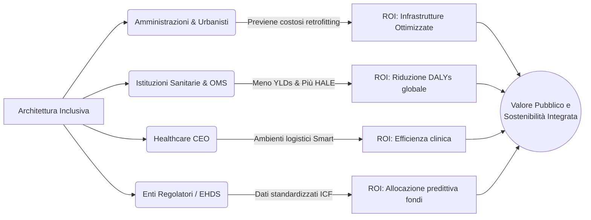

---
tags:
  - synthesis
  - stakeholder-mapping
  - roi
  - approfondimento
ultimo_aggiornamento: 2026-06-08
---

# 👥 Stakeholder Mapping - Analisi del Valore (ROI) Inclusivo

## Sintesi dell'Analisi (Modalità 8)
L'analisi delle fonti del taccuino "Sulla disabilità" ha permesso di mappare le preoccupazioni e le sfide affrontate da diverse tipologie di decisori (policy-maker, amministrazioni pubbliche, istituzioni sanitarie ed economiche). La letteratura dimostra che gli interventi di Universal Design e architettura inclusiva non rispondono solo a imperativi morali, ma offrono un **Ritorno sull'Investimento (ROI) tangibile** in termini di salute pubblica, sostenibilità infrastrutturale e produttività economica.

### 1. Amministrazioni Pubbliche e Urbanisti (City Planners)
**Preoccupazioni e Sfide:**  
La principale preoccupazione è la massimizzazione del valore dell'infrastruttura urbana. Piani di riqualificazione costosi (es. "Città in 15 minuti", "Complete Streets", forestazione urbana) rischiano di fallire o di escludere un ampio segmento della popolazione se applicano un mero "check-box approach" normativo. La *Falsa Prossimità* o l'ignorare i "Last millimeter problems" genera *Activity Inequality*, esacerbando l'isolamento delle fasce deboli.
**Il Valore dell'Architettura Inclusiva (ROI):**  
Investire nel co-design con la comunità e nell'adozione di "disability-centered urban metrics" (mappando su micro-scala) genera un ROI massiccio. Ambienti accessibili (senza barriere, illuminati adeguatamente, sensorialmente equilibrati) incoraggiano l'attività fisica di massa, riducendo l'uso dei trasporti specializzati e minimizzando i costi dei retrofitting successivi. Città accessibili aumentano la coesione sociale e massimizzano l'utilità delle infrastrutture pubbliche per il 100% dei residenti.

### 2. Istituzioni Sanitarie, OMS e Analisti Epidemiologici
**Preoccupazioni e Sfide:**  
Sia i dati globali (Global Burden of Disease 2021) che quelli nazionali (The burden of disease in Italy, 2026) mostrano un aumento inarrestabile delle Malattie Non Trasmissibili (NCDs) e un progressivo invecchiamento della popolazione. L'emergenza è che, sebbene le persone vivano più a lungo (aumento della Life Expectancy), trascorrono molti più anni convivendo con disabilità e declino funzionale (aumento vertiginoso degli YLDs).
**Il Valore dell'Architettura Inclusiva (ROI):**  
L'ambiente costruito è una leva di salute pubblica potente quanto il settore farmaceutico. Progettare in ottica biopsicosociale (ICF) introduce "Facilitatori Ambientali" in grado di abbassare attivamente l'impatto della patologia. Ridurre i *Disability-Adjusted Life Years (DALYs)* attraverso spazi urbani che mantengono l'autonomia degli anziani e dei neurodivergenti genera risparmi incalcolabili per i sistemi sanitari (meno ospedalizzazioni, meno necessità di cure a lungo termine e un aumento della *Healthy Life Expectancy - HALE*).

### 3. Healthcare CEO e Gestori Ospedalieri
**Preoccupazioni e Sfide:**  
All'interno delle strutture (es. sale operatorie, integrazione di tecnologie sanitarie digitali), la preoccupazione principale è l'efficienza logistica e la sostenibilità ambientale. Le tecnologie o le "policy" spesso falliscono perché l'ambiente fisico non è stato predisposto per accoglierle (es. barriere infrastrutturali per l'adozione del digitale o per la gestione dei rifiuti sostenibili).
**Il Valore dell'Architettura Inclusiva (ROI):**  
In ambito ospedaliero, i cosiddetti "smart environments" progettati secondo i principi del behavioural design azzerano l'attrito per i professionisti sanitari. Ottimizzare gli spazi logistici (come le Operating Theatres) per facilitare comportamenti ecologici e procedure digitali incrementa il ROI abbattendo gli sprechi, ottimizzando i tempi di lavoro e riducendo il rischio di burnout del personale.

### 4. Enti Regolatori del Dato (European Health Data Space)
**Preoccupazioni e Sfide:**  
A livello sovranazionale (es. EHDS in Europa), il problema è la "readiness" e l'interoperabilità dei dati. Mancano ontologie standardizzate per descrivere il "funzionamento umano" (es. dati ICF).
**Il Valore dell'Architettura Inclusiva (ROI):**  
Standardizzare il dato ambientale e disabilitante permette all'Unione Europea di sviluppare intelligenza artificiale applicata alle politiche pubbliche. Un ecosistema di dati strutturato abilita l'allocazione predittiva ed efficiente dei fondi strutturali (PNRR, fondi UE).

## Conclusioni
Rispondere ai "last millimeter problems" non è più una questione di carità o compliance normativa; è diventata una priorità di policy, systems and environment (PSE). Un ambiente disabilitante brucia ricchezza (sotto forma di DALYs e inefficienze), mentre un'architettura progettata universalmente si ripaga da sola attraverso un invecchiamento in salute (HALE) e una drastica riduzione del carico assistenziale socio-sanitario.

## Ground Truth (Fonti Principali)
- [[Paper - Global Burden of Disease Study 2021]]
- [[Paper - The burden of disease in Italy]]
- [[Paper - 15-minute cities, walkability and last millimeter problems]]
- [[Paper - EPMC ICF and EHDS]]
- [[Paper - Barriers and facilitators to sustainable operating theatres]]
- [[Paper - Barriers and facilitators to utilizing digital health technologies]]
