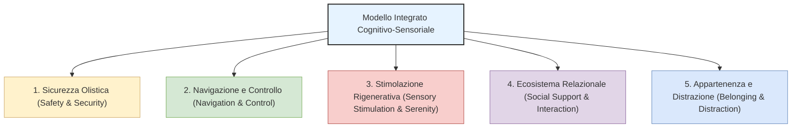

---
tags:
  - synthesis
  - giardini-terapeutici
  - confronto-framework
taccuino: "[[Notebook - giardini terapeutici]]"
modalita: "Confronto e Integrazione di Framework (Modalità 5)"
ultimo_aggiornamento: 2026-05-23
---

# 📑 Sintesi: Confronto Framework Descalzo vs Beh

## 🎯 Obiettivo dell'Analisi
Lo scopo di questa sintesi è effettuare un'analisi comparativa e un'integrazione sistematica dei due framework teorici e progettuali dominanti nel taccuino **Giardini Terapeutici (Healing Gardens)**:
1. Le **7 Percezioni Terapeutiche** proposte da Teresa Sánchez-Jáuregui Descalzo (2024).
2. I **4 Parametri di Design Cognitivo** proposti da J. Beh, M. Yew, K. Tan e J.P. Rayner (2025).

Mentre il framework di Descalzo (2024) affonda le sue radici in una prospettiva storico-umanistica e architettonico-emotiva, il modello di Beh (2025) si concentra sul rigore clinico-riabilitativo e sulla progettazione per il deterioramento cognitivo (*cognitive impairments*). L'obiettivo finale di questa sintesi è tracciare le convergenze, le divergenze e proporre un **Modello Integrato di Design Cognitivo-Sensoriale** ad uso dei progettisti.

---

## 📊 Matrice Comparativa dei Framework

| Parametro di Confronto | Framework Descalzo (2024) | Framework Beh et al. (2025) |
| :--- | :--- | :--- |
| **Focus Principale** | Psycho-emozionale, esistenziale e storico-architettonico. Umanizzazione dello spazio. | Clinico-riabilitativo, neurologico e funzionale. Natura come ausilio clinico. |
| **Metodologia d'Origine** | Analisi storico-comparativa e revisione critica di casi studio ospedalieri contemporanei. | Ricerca-azione qualitativa (interviste e osservazioni comportamentali) al Royal Talbot. |
| **Pilastri Fondanti** | **7 Percezioni Terapeutiche:** Ritiro, Sicurezza, Serenità, Distrazione, Appartenenza, Controllo, Supporto Sociale. | **4 Parametri Cognitivi:** Stimolazione Sensoriale, Sicurezza e Protezione, Interazione Sociale, Facilità di Navigazione. |
| **Target di Riferimento** | Pazienti ospedalieri generalisti, anziani fragili e caregiver. | Individui con deterioramento cognitivo grave e traumi neurologici in riabilitazione. |

---

## ⚖️ Analisi Critica: Convergenze e Complementarità

### 1. Le Aree di Convergenza (Punti Comuni)
* **La Sicurezza come Fondamento Assoluto:** La percezione di **Sicurezza (Security / Safety)** è considerata da entrambi i framework la precondizione indispensabile per l'uso del giardino. Descalzo la definisce come assenza di ostacoli psicologici ed emotivi, mentre Beh la declina in elementi fisici antirischio a tutela dei deficit neurologici. Se lo spazio è percepito come insicuro, genera ansia impedendo qualsiasi beneficio clinico.
* **La Socializzazione contro l'Isolamento:** Il **Supporto Sociale (Social Support)** di Descalzo converge pienamente con gli **Spazi per l'Interazione Sociale (Social Interaction Spaces)** di Beh. Entrambi gli autori riconoscono che il giardino deve fungere da catalizzatore relazionale, offrendo arredi e spazi flessibili che incoraggino l'incontro, riducano l'isolamento involontario e offrano sollievo a familiari e caregiver.
* **Autonomia e Navigazione:** Il concetto di **Controllo** (inteso come facoltà del paziente di scegliere dove sostare e come muoversi) si salda con la **Facilità di Navigazione (Ease of Navigation)**. Un tracciato chiaro, prevedibile e leggibile è lo strumento primario per restituire autonomia decisionale e orientamento a chi soffre di declino cognitivo.

### 2. Le Aree di Divergenza (Complementarità)
* **Restaurazione Emotiva vs. Riabilitazione Attiva:** Descalzo pone forte enfasi su percezioni contemplative e passive legate al benessere spirituale (il **Ritiro**, la **Serenità**, la **Appartenenza** identitaria al luogo e la **Distrazione** intesa come allontanamento mentale dal trauma della clinica). Beh, al contrario, si concentra sulla riabilitazione attiva e sulla stimolazione cerebrale: la **Stimolazione Sensoriale** viene trattata come esercizio sensomotorio per favorire la plasticità neuronale dei pazienti in fase di riabilitazione post-traumatica.
* **Lieve Miglioramento vs. Progettazione Specialistica:** Descalzo suggerisce che anche "lievi miglioramenti" estetico-botanici in ospedali tradizionali possano innescare sentimenti terapeutici universali. Beh esige invece una progettazione specialistica basata su percorsi complanari circolari e segnaletica dedicata per compensare attivamente i deficit neurologici sul campo.

---

## 🧠 Il Modello Integrato di Design Cognitivo-Sensoriale

Per superare la frammentazione e offrire uno strumento unificato ai progettisti, questa sintesi propone un **Modello Integrato** basato su 5 pilastri che fondono il rigore riabilitativo di Beh con l'umanizzazione spaziale di Descalzo:

1. **Sicurezza Olistica (Fisica e Percettiva):** Integrazione di percorsi privi di ostacoli fisici o radici (Beh) con l'eliminazione di trigger visivi e abbagliamenti cromatici che minacciano la sicurezza psicologica del paziente (Descalzo).
2. **Navigazione e Controllo Autonomo:** Sviluppo di percorsi circolari continui ad anello per facilitare il wandering sicuro (Beh), associati a una disposizione di arredi flessibili che consentano al paziente di scegliere autonomamente dove sedersi (Descalzo).
3. **Stimolazione Rigenerativa Calibrata:** Attivazione di "stanze sensoriali" botaniche non tossiche per l'esercizio sensomotorio controllato (Beh), bilanciate da specchi d'acqua e zone d'ombra che stimolino la rigenerazione passiva dell'attenzione tramite la *Soft Fascination* (Descalzo).
4. **Ecosistema Relazionale e di Supporto:** Progettazione di nicchie di sosta protette per piccoli gruppi e arredi adatti all'interazione tra pazienti e caregiver (Beh), assecondando il bisogno di connessione sociale in un ambiente non istituzionale (Descalzo).
5. **Appartenenza Territoriale e Distrazione Attiva:** Utilizzo di essenze botaniche locali ed elementi architettonici che favoriscano la connessione identitaria e affettiva con il paesaggio locale (Descalzo), distraendo attivamente la mente dal trauma ospedaliero.

---

## 🔗 Ground Truth (Fonti e Prove)
*Riferimenti diretti alle note del Vault che validano l'analisi comparativa:*
- [[Paper - Relationship healthcare architecture and nature Descalzo 2024]] — *Definisce le 7 Percezioni Terapeutiche e analizza i casi di studio europei.*
- [[Paper - Critical landscape design elements Royal Talbot Beh 2025]] — *Definisce i 4 Parametri di Design Cognitivo basandosi sul centro di riabilitazione di Melbourne.*
- [[Thesis - I giardini terapeutici la riscoperta dei cinque sensi]] — *Fornisce prove sull'efficacia dell'integrazione sensoriale e biofilica.*
- [[Casestudy - Royal Talbot Rehabilitation Centre (Melbourne)]] — *Il caso studio alla base del framework clinico di Beh.*
- [[Casestudy - Comunidad Terapéutica Can Zariquiey]] — *Esempio applicativo del framework di Descalzo (Appartenenza e Supporto Sociale).*

---
**Note:** Questa sintesi è stata generata tramite interrogazione avanzata della KB (Modalità 5).
